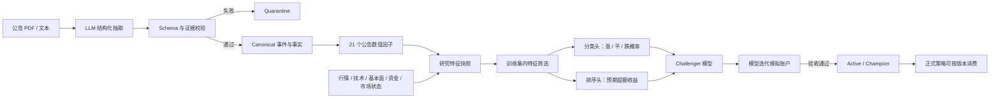

# 公告智能抽取纠偏与继续执行交接

更新日期：2026-07-27

适用对象：接手公告语义抽取的 Claude、Codex 或其他执行 Agent

前置材料：

- `docs/announcement-intelligence-agent-handoff.md`
- `docs/announcement-intelligence-runbook.md`
- `data/claude/notes/2026-07-27-intelligence-handoff-report.md`

## 1. 结论先行

Claude 没有偏离“从海量公告中抽取结构化信息”这个业务目标，但在评估方法和
生产接入方式上发生了偏航：

1. 读取全文、按严格 Schema 输出、保留原文证据、做 A/B 抽取，这些方向正确。
2. 用同一个 Claude 的 A/B 输出互相合成 Gold，再用 Candidate 对这个 Gold 打分，
   只能测自一致性，不能测真实准确率。
3. `manifest.event_family` 是由标题关键词规则生成的弱标签，不是人工真值。将其
   告诉模型后强制重抽 45 篇，形成了循环验证。
4. 当前 240 份结果有研究和数据探索价值，但不能直接写入 canonical 事件、公告
   因子或正式股票模型。
5. `claude-subagent-file` 是一次性离线产出方式，不是 ECS 可定时、可重试、
   可追溯的生产 Provider，因此不能直接成为 Champion。

这次工作的正确定位应当是：

> 全量生产抽取是主线；冻结样本、Anchor Gold 和 benchmark 是发布前的质量闸门。
> 两者不是二选一，benchmark 服务于生产，而不是替代生产。

## 2. 对 Claude 六个问题的直接回答

### 2.1 项目的真实目标是什么

真实目标是持续从全量公告语料中提取可计算、可追溯、可回放的结构化事件，并
把经过验证的事件转成股票研究特征。

benchmark 不是业务终点。它的作用是防止 prompt、模型或 Provider 更新后出现
无声退化，并决定某个语义版本能否进入生产。

### 2.2 240 篇是什么

240 篇是固定、冻结的评估和研发样本，不是生产全量。

生产全量由已有日增量链路承担：

```text
公告目录 -> PDF/OSS -> 解析/分块 -> 语义抽取 -> 确定性验证
        -> canonical/quarantine -> 事件因子 -> 研究模型
```

ECS 已有 intelligence systemd 任务负责目录、下载、解析、语义和验证。240 篇只
用于选择和回归测试语义版本。

### 2.3 抽出的信息给谁使用

有三个消费层级：

1. Dashboard 和数据下钻：展示事件、事实、证据、隔离原因和处理状态。
2. 公告因子层：把 canonical 事件转换成 21 个 point-in-time 数值特征。
3. 股票研究模型：把公告特征与行情、技术、基本面、资金和市场状态特征一起训练，
   输出上涨/横盘/下跌概率及预期超额收益。

它不是把 LLM 的“买入/卖出建议”直接交给策略，也不是单独的周度情绪标量。

### 2.4 是否需要 Gold，由谁标

需要一小套独立 Anchor Gold，但不需要给全部历史语料做人工 Gold。

Anchor Gold 的用途是测量发布质量，推荐规则如下：

- 标注者不能看到 Candidate 输出和 `manifest.event_family`。
- 至少两份独立标注；分歧由第三方仲裁。
- Gold 必须同时核对事件身份、事实字段和语义证据，不只是 JSON 合法。
- 可由不同模型、不同 Agent 或人工组合完成，但不能由同一个 Candidate 自产自评。
- 生产阶段继续采用抽样复核、异常隔离、漂移监控和线上因子表现，不追求全量人工标注。

### 2.5 那 45 篇应如何处理

这 45 篇应归类为“争议弱标签集”，不能算 Gold，也不能算 Candidate 成绩。

重新处理时不得提供目标事件族。对于法律意见书、独立财务顾问意见等派生文件，
采用以下判断：

- 文件包含新的金额、日期、对象、状态变化或否决信息：可抽取新事实或修订关系。
- 文件只重复已有事项并确认合规：作为 corroborating evidence 或 duplicate/revision
  关系，不重复创造一个新的基础事件。
- 文件只讨论程序和法律意见，无法确认实际事件已经发生：标为 `no_event` 或隔离，
  不因为标题弱标签而强制制造事件。

### 2.6 当前 240 篇是否有直接生产价值

有研究价值，没有直接生产资格。

建议将当前 `gold.jsonl` 在逻辑上重新标记为 `Silver v0`，保持文件和 hash 不变，
通过旁路元数据或新目录说明它的来源，不删除、不覆盖。它可用于：

- 发现 Schema、prompt 和 taxonomy 的缺口；
- 建立错误类型库和困难样本库；
- 作为 prompt 开发集或弱监督数据；
- 人工/独立 Agent 建 Anchor Gold 时的候选参考，但标注者不能预先看到它。

它不得直接用于：

- 计算对外宣称的模型准确率；
- 晋升 Champion；
- 批量写入 canonical 事件；
- 开启正式公告因子或改变两套正式策略。

## 3. 对现有工作的评价

### 3.1 做对的部分

- 240 篇读取了完整解析文本，而不是只看标题。
- 输出遵循严格 JSON Schema，并保留页码、chunk、offset 和 quote。
- 引用做了原文存在性检查，具备进一步验证的基础。
- A/B 策略暴露了 precision/recall 取舍和困难样本。
- 未绕过质量门禁晋升 Champion，这是正确的停止点。
- Claude 在报告中主动识别了自制 Gold 的方法学问题。

### 3.2 需要修正的部分

- 不能把 A/B 一致当作事实正确，只能记为模型一致。
- 不能把标题关键词得到的 `event_family` 当外部真值。
- 不能用 `manifest.event_family` 引导模型后，再用同一标签证明结果正确。
- `text.find(quote)` 只能证明字符串存在，不能证明该引用支持对应事实。
- 事件匹配不能只看事件类型和 lifecycle，还要核对主体、时间、事实和事件身份。
- 一次性的 Claude 子进程文件输出没有生产调度、重试、预算、幂等和 lineage 契约。
- 当前 7 项门槛是研发期保守初值。不能为了通过而降低，但也不能在没有独立
  Anchor Gold 的情况下把这些数字解释成可靠的生产质量结论。

## 4. 当前产物重新分级

| 产物 | 新定位 | 可用范围 |
| --- | --- | --- |
| Candidate A/B 的 480 份输出 | Experimental Candidate | 提示词研究、错误分析 |
| 当前 `gold.jsonl` 240 行 | Silver v0 | 弱监督、困难样本、研发参考 |
| 45 份带类别提示的重抽结果 | Disputed weak-label set | 盲审清单，不参与评分 |
| A/B benchmark 报告 | Self-consistency diagnostics | 比较两种 prompt 行为 |
| 未来独立标注样本 | Anchor Gold | 发布质量评估 |
| 未来可重复运行的通过版本 | Champion | 全量生产抽取 |

不要删除旧产物。重新分级应通过 manifest、README 或 registry 元数据完成，保持
原始 hash 和 lineage 可追溯。

## 5. 接下来需要完成的修正

### P0：先恢复正确边界

1. 保留并归档现有 480 份输出、Silver v0、benchmark 报告和错误样本。
2. 明确记录 `manifest.event_family` 的来源是标题规则弱标签，禁止再作为 Gold 输入。
3. 保持 Champion 为空，不把 Silver 写入 canonical 事件和模型特征。
4. 将 `claude-subagent-file` 标成 offline experiment。生产配置必须恢复到一个
   ECS 可实例化的 Provider，或实现正式 Provider factory 后再启用新类型。
5. 给法律意见书等派生文档补充统一标注政策，避免“全部 no_event”和“强制有事件”
   两个极端。
6. 对 Claude 修复的 `benchmark.py` int/str key 问题补回归测试；不保留依赖行号和
   `.bak` 文件的临时修复方式。

P0 完成标准：

- 生产配置不会尝试调用不存在的 `claude-subagent-file` runtime。
- registry 中无误晋级 Champion。
- 现有产物来源和等级可从元数据读出。
- 45 篇不再被统计为外部 Gold。

### P1：建立可信的 Anchor Gold 和评估方式

1. 从冻结集选第一批 80 篇，覆盖 15 类事件、no_event、长文、表格、法律意见书和
   A/B 分歧样本。若分歧率过高，再扩到完整 240 篇。
2. 两名标注者盲标，不得看 Candidate、Silver 或 manifest 类别；第三名只看分歧项。
3. Gold 记录标注者、时间、依据、仲裁理由和 annotation hash。
4. 将指标拆开：
   - quote 是否在原文；
   - quote 是否语义支持对应事实；
   - 事件是否识别正确；
   - 主体、日期、金额、单位和币种是否正确；
   - `no_event` 是否错误漏报。
5. 事件匹配加入主体、关键事实和时间约束，避免只按事件族宽松对齐。
6. 报告总体指标、分事件族指标、困难文档指标和置信区间。
7. 基于 Anchor Gold 的错误成本重新确认发布门槛。不得为了让现有 Candidate 通过
   而反向调低门槛。

P1 完成标准：

- Anchor Gold 与 Candidate 生成过程相互独立。
- 同一 Candidate 可重复运行并得到相同身份和可解释差异。
- 每项发布指标都有明确分母、匹配规则和失败样本。

### P2：接入可持续生产 Provider 并闭环到模型

优先路径仍是稳定的 OpenAI-compatible API。若必须使用 Claude/Coding Plan，
需要把它包装成真正的批处理 Provider：

- 导出任务包含不可变 input hash、prompt/schema/taxonomy/parser 版本；
- 导入结果校验 provider identity、output hash、Schema 和 evidence；
- 支持幂等、断点续跑、失败分类、重试、预算和并发限制；
- ECS worker 可由 systemd 定时调用，不依赖人工打开聊天窗口；
- 原始输出写 OSS，数据库只保存 URI、hash、状态和用量；
- 通过统一 Provider factory 进入 benchmark 和 production pipeline。

上线顺序：

1. 单篇真实公告 canary。
2. 20 篇困难样本 canary。
3. Anchor Gold 全量 benchmark。
4. 只有通过且可重复运行的版本才能晋升 Champion。
5. 运行全量日增量语义与确定性验证。
6. 公告因子至少观察 20 个交易日，检查覆盖率、延迟、误报、Rank IC、ICIR、
   衰减和消融。
7. 通过模型迭代账户验证后，才允许某些公告因子进入 Active 模型。

P2 完成标准：

- `semantic_runs` 和 `event_candidates` 有真实生产数据。
- semantic 失败不阻断公告抓取、Dashboard 和纸面交易。
- canonical 事件都有证据和事实来源；quarantine 不进入因子。
- 21 个公告因子可被研究快照加载，但在证据不足时保持 `observing`。
- 模型 registry 能说明哪个模型版本选择了哪些公告因子。

## 6. LLM 信息最终如何存储

LLM 结果不是存成一大段文本后直接喂股票模型，而是分四层保存。

### 6.1 原始语义运行层

原始模型 JSON 写入私有 OSS。SQLite 的 `semantic_runs` 保存：

- document、artifact、provider、model；
- prompt/schema/taxonomy/parser 版本；
- input/output hash 和 output URI；
- 成功、no_event、可重试失败、永久失败等状态；
- token、延迟、成本和错误。

这层用于重放、审计、定位模型版本和恢复失败，不直接进入股票模型。

### 6.2 结构化事件层

确定性校验后写入 `intelligence.sqlite3`：

| 表 | 内容 |
| --- | --- |
| `event_candidates` | 事件类型、生命周期、完整 payload、canonical/quarantine |
| `event_evidence` | 页码、chunk、offset、quote 和 quote hash |
| `event_facts` | 金额、数量、日期、对象、单位、币种、期间和来源 |
| `event_scores` | relevance、novelty、materiality、certainty、direction、confidence |
| `event_relations` | revises、cancels、completes、duplicates、supersedes |
| `events` | 通过验证的 canonical 市场事件 |

只有 canonical 事件可以进入下游。quarantine 保留供排查，但不进入因子或模型。

### 6.3 数值特征层

系统按股票和交易日，以 point-in-time 方式把事件转成 21 个数值列，例如：

- `event_positive_decay_5d`、`event_negative_decay_5d`
- `announcement_novelty_20d`
- `event_relevance_20d`
- `event_materiality_positive_20d`、`event_materiality_negative_20d`
- `event_certainty_20d`、`event_revision_risk_20d`
- `earnings_event_score_20d`、`buyback_event_score_20d`
- `contract_event_score_60d`、`legal_risk_event_score_60d`
- `delisting_risk_event_score_60d`、`capital_structure_event_score_60d`

它们与行情、均线、MACD、量价、基本面、估值、资金和市场状态等特征一起写入
研究 feature snapshot Parquet。

### 6.4 模型和预测层

训练后的模型保存为 `.joblib`，同时保存 metadata JSON 和 registry。每天的预测
保存为 Parquet，主要包括：

- `p_up`、`p_flat`、`p_down`
- confidence
- expected excess return
- return quantiles
- model version、feature snapshot 和失效原因

## 7. 公告信息如何贡献给股票模型

完整链路如下：



贡献方式不是预设“某条回购公告一定加多少分”。训练时，系统只使用训练窗口：

1. 删除覆盖率不足或恒定的特征；
2. 计算特征与未来超额收益的截面 Rank IC；
3. 检查不同时间窗口中方向是否稳定；
4. 去掉与已选特征高度相关的冗余列；
5. 最多选择约 32 个特征进入模型。

因此，公告因子只有在覆盖率、稳定性和增量预测价值足够时才会被模型选中。若它
没有增量价值，即使语义抽取本身很准确，也不应强行进入模型。

当前 21 个公告因子全部是 `observing`。这意味着它们可以被生成、展示和评估，
但尚未对两套正式策略的下单产生影响。

## 8. 股票模型到底是什么

当前股票模型是经典机器学习和统计模型的集成，不是深度学习，也不是 LLM。

它有两个预测头：

1. 分类头：
   - Logistic Regression
   - HistGradientBoostingClassifier
   - 对两者概率做校准和加权集成
   - 输出上涨、横盘、下跌概率
2. 排序头：
   - Ridge Regression
   - 三个不同随机种子的 HistGradientBoostingRegressor
   - 加权输出未来预期超额收益

训练采用 purged walk-forward、embargo、独立校准窗口、概率校准、特征稳定性和
漂移检查。模型先进入 research，再进入独立的模型迭代模拟账户；累计足够的 shadow
cycle 并通过门禁后，才可变成 Active/Champion。

可以把三层角色简单理解为：

- LLM：把公告“读懂并翻译”为结构化事实。
- 因子工程：把事实变成每只股票、每个交易日可计算的数字。
- 股票模型：学习这些数字与未来收益的统计关系，输出概率和排序。

现阶段没有必要为了“更先进”而直接改成 Transformer 或其他深度学习。公告语料
和标签的有效样本量、时间一致性与数据质量，往往比模型复杂度更重要。后续若经典
模型在稳定数据上达到瓶颈，可把深度模型作为独立 Challenger 做同样的样本外和
模拟账户比较，而不是直接替换现有 Champion。

## 9. 下一位 Agent 的交付清单

下一位 Agent 应按顺序交付：

1. 产物分级与来源说明：Candidate、Silver、Disputed、Anchor Gold、Champion。
2. `manifest.event_family` 弱标签来源说明和禁止泄漏检查。
3. 法律意见书/派生文件标注政策及回归样本。
4. 独立 Anchor Gold 和新版 benchmark 报告。
5. ECS 可重复调用的 Provider 实现与 provider factory。
6. 1/20/Anchor Gold 三阶段 canary 结果。
7. Champion 晋升或明确的不晋升报告。
8. 全量日增量 semantic/validate 的生产运行证据。
9. 21 个因子的 20 交易日观察报告与消融结果。
10. 模型 registry 中公告因子的选择、拒绝和版本 lineage。

每一步必须区分：

- 代码或配置已存在；
- 静态测试已通过；
- 真实数据已运行；
- ECS 定时任务已验证；
- 下游模型已实际消费；
- 正式策略已激活。

不得用其中一层的证据替代下一层。
