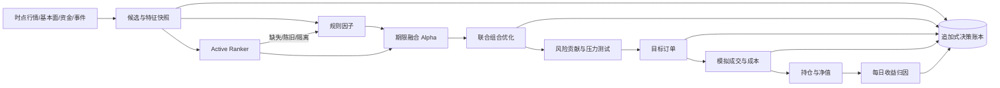
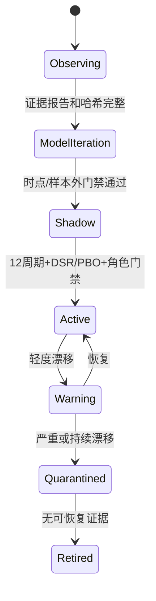

# P0-P2 量化系统成熟化说明

更新日期：2026-07-24

本轮把“能跑的模拟系统”补成“决策可重建、研究可验收、失败可隔离”的研究平台。
范围仍是 A 股和境内跨境 ETF 纸面交易，不连接真实券商，也不承诺收益提升。

## 1. 完成后的主链

正式账户的 CSV/JSON 仍是交易事实；`data/shared/research_lineage.sqlite3`
是可重建查询投影。模型研究和 Dashboard 不得反向修改正式账户。

## 2. P0：决策正确性

| 能力 | 实现结果 | 失败语义 |
| --- | --- | --- |
| 模型角色门禁 | Classifier、Ranker、Portfolio 分别验收；正式策略只消费对应 Active 角色 | 某一角色失败不冒充全部模型通过 |
| 明确期限 | 稳健防守使用 10/20 日，趋势进攻使用 3/5 日；权重、版本和陈旧度写入每次决策 | 缺失或陈旧时退回固定规则 |
| 决策账本 | 记录决策、候选、淘汰原因、权重、约束、订单、成交和归因 | SQLite 损坏可从 canonical 产物重建 |
| QDII 时点宇宙 | 使用首次发现、上市、退市和目录历史判断当时是否可选 | 缺少历史证据时标记不可用，不用当前目录回填 |
| 业务失败退出码 | 预测缺失等模型迭代失败返回非零 | systemd 单独告警，但不阻断正式 daily |
| 基金公告风控 | 区分申购、赎回、交易和基金存续范围；官方恢复只清同范围限制 | 聚合页只能发现，未经确认不能硬阻断 |

## 3. P1：组合与研究治理

| 能力 | 核心输出 |
| --- | --- |
| 联合组合优化 | Alpha、协方差风险、成本和换手联合求解；同时约束现金、单券、行业、国家/指数、流动性和总暴露 |
| 风险模型 | 年化波动、跟踪误差、边际/成分风险、集中度、流动性集中度、约束命中和降级原因 |
| 压力测试 | 大盘、行业、波动率以及 QDII 汇率/溢折价冲击的确定性损失估计 |
| 统计治理 | 至少 12 个独立影子周期、Deflated Sharpe、PBO、试验族计数、种子稳定性、子区间稳定性和无偏宇宙 |
| 模型生命周期 | `research -> shadow -> active -> quarantined/retired`，漂移隔离后自动回到上一 Active 或规则策略 |
| 策略差异度 | 联合检查加权持仓重合、收益相关性、每日决策一致率、因子暴露距离和换手风格距离 |
| 每日归因 | 市场、行业、Alpha、现金、成本、约束和残差；始终输出对账差额和缺失证据 |

## 4. P2：情报、监控和解释

原始文档不能直接交易。文档先经过来源可信度、否定/不确定性、方向、强度、
生效时间、去重、新颖度和实体链接，再形成结构化事件。八个情报因子当前全部是
`observing`，只有覆盖率、延迟、事件后异常收益、衰减、误报、多个期限 IC 稳定性
和消融证据同时通过，才会建议进入模型迭代。

Dashboard 新增独立 `governance` 资源和“决策与风控”工作台，包含决策漏斗、
风险压力、收益归因、模型漂移、实验记录、情报证据和策略差异度。持仓被放到
账户总览之后，目标订单保留在页面末尾。飞书日报只显示整体状态、异常和最多
三条最高置信度预测。

## 5. 数据源边界

| 状态 | 数据源 |
| --- | --- |
| 已用于正式模拟 | Tushare 行情/估值/资金/财务/ETF/指数/汇率，Baostock A 股行情降级 |
| 已用于情报研究 | 中国政府网、国家发改委，东方财富基金公告发现层 |
| 契约已定义但尚不可用 | 巨潮公告、上交所/深交所基金公告、基金管理人公告、央行/财政部/统计局/海关、授权商业新闻 |
| 明确不采用 | 同花顺、东方财富、富途 APP 私有接口或逆向抓取；未授权全文和伪造中性事件 |

外部源未授权不是代码缺陷。当前系统会把它显示为 `source_unavailable`，不会拿
缺失值假装“没有利空”，也不会让未确认聚合公告改变正式订单。

## 6. 使用者需要关注什么

平日不需要手动运行交易任务。优先看 Dashboard 的四个信号：

1. “决策与风控”是否存在阻断或降级。
2. 归因对账差额是否接近零，缺失维度是否在减少。
3. Active 模型是否发生 warning/quarantined，正式策略是否已回退规则路径。
4. 两套策略综合差异度是否长期未达标。

周六按飞书提醒运行周度复盘；每月按提醒运行策略演化。新闻、公司公告和官方基金
确认层在获得合规接口或授权前，不需要人工补造数据。
