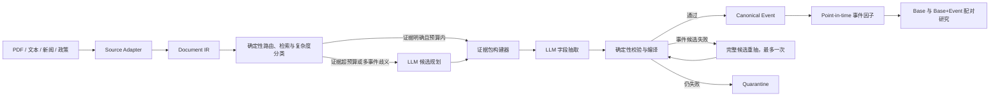
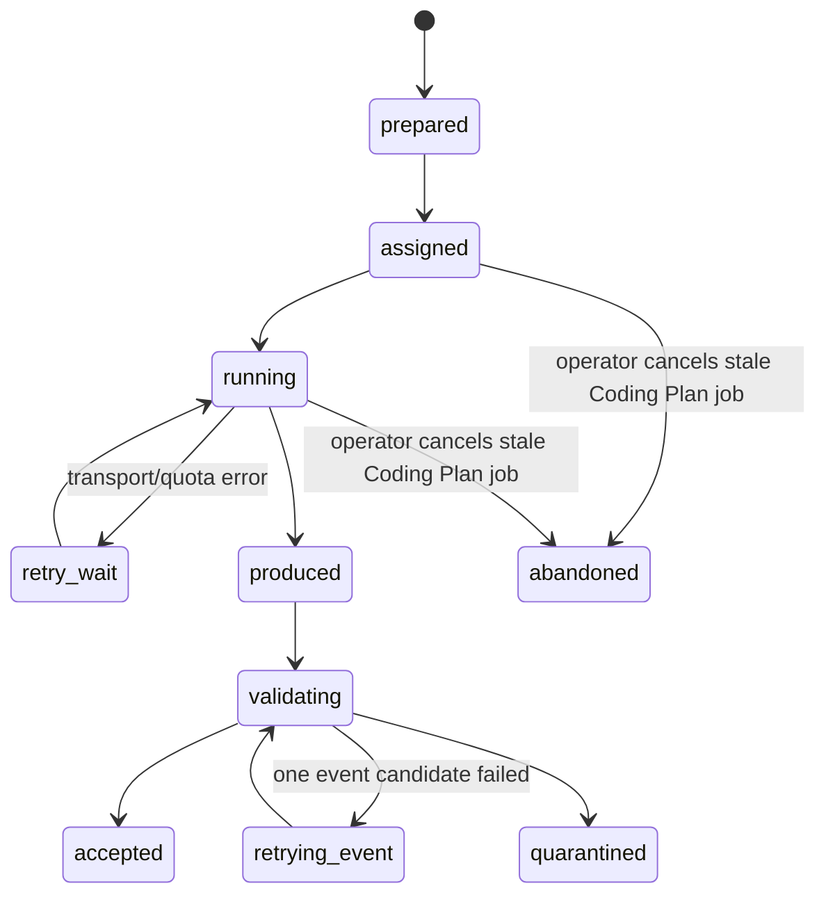
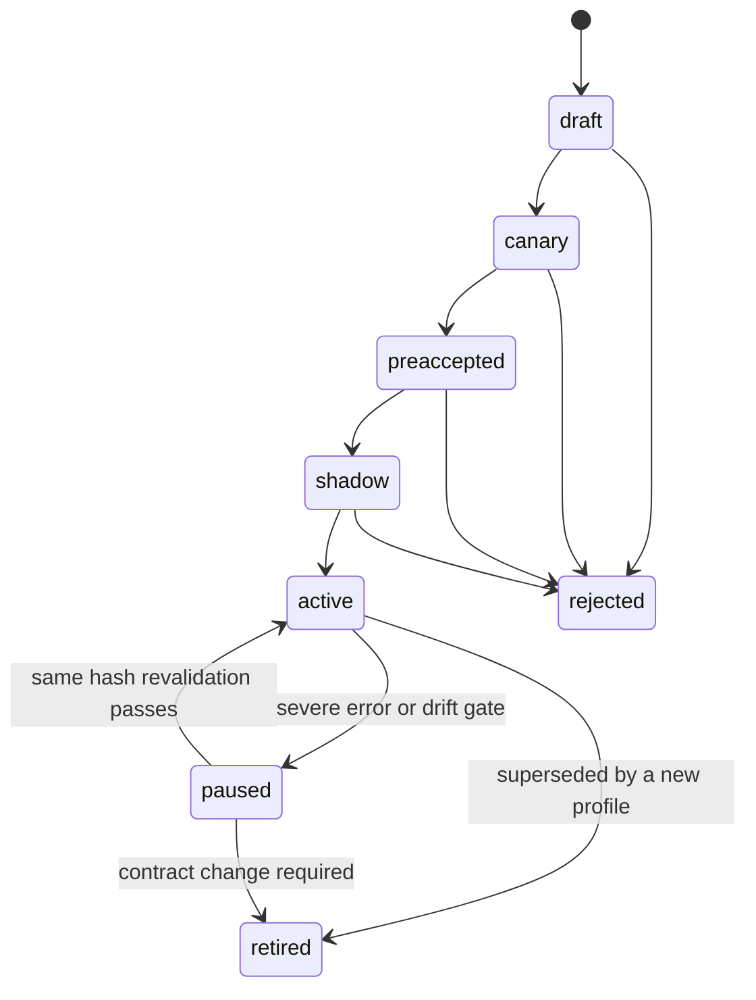

# 结构化、双执行模式的语义抽取 Harness 设计

**日期：** 2026-08-09
**状态：** 已完成 Codex 全局收敛与 Claude 限题复审，可进入实施计划
**首期范围：** A 股上市公司公告
**扩展范围：** 新闻、政策、研报及其他 PDF/文本语料
**安全边界：** 研究因子专用；原文、LLM 输出和单条事件均不得直接触发模拟交易

## 1. 背景与判断

V20 已证明 provider-neutral 的冻结任务、逐字证据校验、事件编译、隔离和
入库链路可以工作，但当前 harness 仍把过多责任交给 LLM：模型需要同时从
长文中定位事件、恢复表格语义、选择字段、绑定主体并组织证据。最后一轮
半年报失败就是典型例子：模型找到了正确数值，却没有同时引用行列标题，
编译器只能拒绝裸数值。

因此下一版不继续堆叠 Prompt 例外，而是先把原始文档编译成可验证的结构，
再让 LLM 在小而明确的证据包中做语义选择。

## 2. 目标与非目标

### 目标

1. 同一冻结语义合同同时支持 API 和 Coding Plan 两种执行模式。
2. Prompt、Schema、Taxonomy、证据规则和下游事件不依赖具体 Provider。
3. 表格数值天然携带行标题、列标题、单位、页码和原文坐标。
4. 默认使用确定性检索加一次 LLM 抽取；只有证据超预算或多事件歧义时才
   增加 LLM 规划阶段。
5. 校验失败时按完整事件候选重抽一次，不原地修改单个字段。
6. 验收阶段严格整批门控；稳定生产后逐篇入库、逐篇隔离，并监控漂移。
7. 任何结果都可由输入 hash、合同版本、执行器身份和原文证据重现。

### 非目标

- 不建设开放式问答或通用 Agent。
- 不让 LLM 生成实体 ID、标准日期、金额换算、生命周期或交易信号。
- 不默认使用多个模型重复抽取全部文档。
- 不在本次改造中证明事件因子能提升策略收益。
- 不删除 V20 及历史 semantic lineage；旧合同保持只读、可回放。

### 设计收敛原则

这版只保留一条生产主线，避免把评估机制、Provider 对照和运行调度混成一套
复杂系统：

- 一个文档对应一个不可变 `semantic_task`，一个具体执行通道对应一个
  `execution_job`；切换通道时新建 job，不修改旧 job。
- 先做结构解析、确定性检索和校验，再把确实需要判断的部分交给 LLM。
- 默认单 Provider 执行，不把 Candidate A/B 或多模型重复抽取变成日常生产步骤。
- 合同 profile 与执行器资格分开管理；某个模型通过验收，不代表其他模型自动
  获得生产资格。
- 事件候选可以单独重抽，但一个文档只能整体入库或整体隔离。

## 3. 总体架构



正常调用预算如下：

- 默认文档：确定性检索后进行一次字段抽取。
- 复杂文档：一次候选规划，加一次字段抽取；只有候选证据总量仍超出冻结上限
  时，抽取阶段才按候选确定性分片。
- 只有事件候选校验失败时，额外允许一次完整候选重抽；仍失败即隔离整篇
  文档。

## 4. Source Adapter 与 Document IR

### 4.1 Source Adapter

每类语料只负责把来源格式转换为统一 IR，不参与事件判断：

- `announcement_pdf`：公告 PDF、正文、表格、OCR。
- `plain_text`：已经解析的纯文本。
- 后续插件：`news_article`、`policy_document`、`research_report`。

Adapter 的输出必须保留来源 URL、发布时间、首次发现时间、解析器版本、
页码、bbox、OCR 状态和内容 hash。

### 4.2 Document IR

IR 由不可变证据节点组成：

- `metadata_node`：标题、发行人、证券代码、发布日期。
- `text_block`：标题、段落、列表项、脚注。
- `table`：表标题、单位候选、行列层级、合并单元格和续表组。
- `table_cell`：原始值、分层表头路径、单位解析、脚注和坐标。
- `relation`：相邻段落、标题归属、表头归属、脚注引用和跨页续表关系。
- `parse_issue`：歧义、OCR 低置信、表头冲突、单位冲突和缺失关系。

表格节点示例：

```json
{
  "node_id": "table-2-cell-r4-c3",
  "node_type": "table_cell",
  "raw_value": "621,408,705.13",
  "row_header_path": [
    {"node_id": "table-2-rh-r4", "level": 0, "text": "营业收入"}
  ],
  "column_header_path": [
    {"node_id": "table-2-ch-c2-c4", "level": 0, "text": "主要会计数据"},
    {"node_id": "table-2-ch-c3", "level": 1, "text": "本报告期"}
  ],
  "unit_resolution": {
    "value": "元",
    "source_node_id": "table-2-unit",
    "rule": "nearest_table_unit",
    "conflicts": []
  },
  "footnote_node_ids": ["table-2-footnote-1"],
  "continuation_group_id": "table-group-financial-summary",
  "page_number": 2,
  "bbox": [72, 318, 526, 346],
  "ambiguity_flags": [],
  "parser_provenance": {
    "parser_version": "announcement-layout-v2",
    "ocr_used": false,
    "transformations": ["merged_header_expansion"]
  }
}
```

表头路径必须保留每一级合并表头及原始 node ID；跨页续表只能通过相同
`continuation_group_id` 继承表头。单位解析优先级固定为单元格显式单位、
同行/同列表头单位、表级单位、正文引用单位；不同来源冲突时不得自动选择，
而是写入 `conflicts` 并使相关事实进入隔离。脚注只作为限定条件，不能替换
数值证据。IR 构建器不得把歧义节点伪装成确定事实。

LLM 不再自行猜测裸数值含义。编译器只接受能够沿 IR 关系找到完整分层表头、
原始数值和无冲突单位的表格事实。IR 本身也不是绝对真理：每个证据包在
调用 LLM 前先经过结构校验，IR 缺陷与 Provider 输出缺陷使用不同错误码。

## 5. 任务规划与证据包

### 5.1 确定性预路由

路由器使用标题、文档类型、结构信号和版本化规则排除治理制度、会议通知、
否定式调查/退市表述和纯会计科目。它只缩小候选范围，不直接产生事件。

### 5.2 复杂度分类

V21 的默认复杂度合同使用可复现条件；满足任一条件才进入 LLM Planner：

- 确定性路由得到两个及以上候选事件类型。
- 同一主体角色存在两个及以上无法由局部上下文排除的绑定候选。
- 初始证据包序列化后超过 profile 的 `max_evidence_packet_chars`。V21 初值为
  `24,000` 字符，并固定为所有合格执行器共同遵守的合同参数。
- 必需事实跨越两个及以上非连续章节或两个续表页面。
- IR 含 `ambiguous_header`、`unit_conflict` 或 `multiple_economic_meanings`
  标记，且候选可以通过缩小证据范围解决。

单纯存在表格、OCR 或长文不会自动触发 Planner。阈值属于 profile 的冻结
配置，Provider 不得根据自己的上下文窗口调整；API 与 Coding Plan 必须消费
相同的受限证据范围。

### 5.3 候选规划

复杂文档的第一阶段只输出：

- 候选事件类型。
- 候选主体名称。
- 可能相关的 IR node IDs。
- 无法判断的原因。

Planner 只读取确定性生成、同样受 profile 字符上限约束的 `planner_index`，
其中包含章节路径、表格标题、节点摘要和候选 node IDs；它不能读取完整原文
绕过证据预算。

它不输出最终事实、生命周期或标准化结果。Planner 的 Schema、grounding
或 node 选择失败时，任务进入统一的 `quarantined` 状态，并记录
`stage=planner` 与 Provider 错误码；不得降级为整篇全文抽取，也不得静默写成
`no_event`。

### 5.4 事件证据包

`semantic_task` 以文档为单位，包含零到多个候选事件。每个候选事件都有独立
证据包，文档级 extractor 默认一次返回 `document_result.events[]`。若所有候选
证据合计超过 `max_evidence_packet_chars`，构建器才按候选确定性分片，执行器
分别落盘各分片输出，编译器合并后仍按整篇文档原子校验和入库。

每个候选事件证据包只包含：

- 文档元数据。
- 该事件允许的主体角色、字段和日期种类。
- 必需字段及生命周期要求。
- 相关文本窗口和完整表格语义路径。
- 严格输出 Schema。

证据包在发送前必须通过 preflight：所有 node 存在、表头路径闭合、续表关系
可达、单位无冲突、序列化 hash 与 manifest 一致。preflight 失败记为
`ir_invalid` 或 `evidence_packet_invalid`，不调用 LLM；Provider 返回非法引用
才记为 `provider_evidence_invalid`。

规划和抽取各自使用一份稳定的通用 Prompt；事件差异来自版本化 Taxonomy
数据，不为 Claude、DeepSeek 或 Codex 维护不同 Prompt。

## 6. API 与 Coding Plan 双执行模式

### 6.1 统一冻结任务包

两种模式消费同一目录：

```text
job.json
input.jsonl
taxonomy.json
document_ir.jsonl
evidence_packets.jsonl
planner_prompt.md
planner_schema.json
extraction_prompt.md
extraction_schema.json
```

简单任务不消费 planner 文件；复杂任务先执行 planner，再执行 extractor。
两份 Prompt 都是稳定、通用且 Provider 无关的系统 Prompt，差异只在阶段
职责，不按模型维护分支版本。

任务包记录每个文件 hash、文档 ID、profile、实际启用阶段对应的
prompt/schema、taxonomy、IR、检索器和 planner 版本。任务创建后不可修改；
任何合同变化必须产生新 profile。

### 6.2 合同等价的 Executor 接口

```text
execute(frozen_task) -> raw_result_envelope
```

结果信封必须包含：

- `execution_job_id`、`semantic_task_id`、`document_id` 和输入 hash。
- `executor_mode`: `api` 或 `coding_plan`。
- Provider、模型、客户端版本和可信身份来源。
- Planner/Extractor Prompt、Schema、Taxonomy、IR 和 evidence packet hash。
- 每个阶段或分片的原始结构化输出、request/session ID、token 和耗时。

“合同等价”指两种模式获得相同 evidence packet、阶段 Prompt、Schema 和
Taxonomy，并产生相同结果信封；不承诺内部推理过程、延迟、token 或错误
行为相同。任务输入按 profile 的 `max_evidence_packet_chars` 裁剪，该参数必须
不高于所有生产合格执行器中最小的安全输入能力。Coding Plan 不能读取任务包
之外的额外正文来获得不公平的信息优势。

执行器只能负责传输和调用，不能修改语义合同。复杂任务即使在一个 Coding
Plan 会话中连续完成，也必须分别落盘 planner 与 extractor 的阶段输出。

### 6.3 API 模式

- 用于 ECS 每日新增公告。
- 凭据由部署环境注入，不写入任务包和产物。
- 支持同步调用或 submit/poll 异步调用。
- 每篇独立 checkpoint，quota/rate limit 可恢复。
- 默认一个生产 Provider；当前候选为 DeepSeek。

### 6.4 Coding Plan 模式

- 用于本机历史回填、疑难文档和限量仲裁。
- Runner 把冻结任务逐篇交给 Codex、Claude 或其他 Coding Plan。
- Coding Plan 不生成批次脚本，不修改任务包，不访问生产数据库，也不直接入库。
- Runner 负责写入可信执行器身份、checkpoint 和统一结果信封。
- Coding Plan 不限制内部推理 token，但可见语料和输出仍受冻结任务边界约束。

### 6.5 执行通道分配与幂等

首期不实现动态 claim/lease：

- `executor_mode`、Provider 和模型在 execution job 创建时固定，语义任务内容
  仍由独立的 `semantic_task_id` 标识。
- 每个 execution job 只能由指定通道执行。API dispatcher 不读取 Coding Plan
  job；Coding Plan runner 也不能消费 API job。
- Coding Plan 长时间未回传时，operator 将该 execution job 标为 `abandoned`，
  再基于相同 `semantic_task_id` 创建新的 execution job；不原地改执行通道。
- 导入键包含 semantic task、execution job、输入和输出 hash；重复上传同一
  结果必须幂等。
- 同一 semantic task 的迟到或多 Provider 结果作为独立 run 保存。只有当前
  指定 execution job 的合格结果可以自动晋级，其他结果进入对照审计。

这样不需要全局 ECS 锁，也不需要离线续租协议；中央 dispatcher 只创建和
查询短事务状态，不承担长时间锁或单点执行职责。

### 6.6 合同 Profile 与执行器资格

合同 profile 的 hash 只覆盖 Prompt、Schema、Taxonomy、IR、检索、Planner、
Compiler 和冻结参数，不包含 Provider 名称。具体执行组合单独形成
`executor_binding = executor_mode + provider + model + client_version`，资格状态为：

```text
untested -> compatible -> shadow -> production_qualified
                         \-> suspended
```

- `compatible` 表示能遵守冻结合同，只允许影子运行或人工复核后的历史回填。
- `production_qualified` 表示该 binding 独立通过第 9 节生产验收，可以自动入库。
- DeepSeek 通过不使 Claude、Codex 或未来模型自动继承资格。
- 合同缺陷暂停 profile；单模型质量或接口异常只暂停对应 binding；基础设施
  故障只暂停执行通道。三类故障不得互相冒充。

## 7. 校验、编译与修复

校验按固定顺序执行：

1. manifest、输入和合同 hash。
2. IR 和 evidence packet preflight；此时不调用 LLM。
3. Provider 输出 JSON Schema 和枚举。
4. 每个 node ID 是否属于当前证据包。
5. 文本 quote 是否为原文连续子串。
6. 表格事实是否同时拥有完整表头路径、数值和无冲突单位。
7. 主体角色和实体白名单。
8. 必需字段、去重字段和事件类型兼容性。
9. 同一事件的主体、报告期、日期范围、单位和币种一致性。
10. 生命周期只从被引用的状态证据推导。
11. 数值、比例、币种和日期的确定性标准化。
12. 文档内事件一致性、canonical 去重和 point-in-time 时间边界。

一致性规则只表达可以普遍证明的合同，例如范围下界不大于上界、比例位于
其字段允许区间、同一事实的单位来源不冲突、同一事件的报告期不能混用。
不添加“净利润必须小于收入”这类并非普遍成立的财务常识规则。

失败结果返回字段级错误，例如：

```json
{
  "field": "revenue",
  "code": "table_semantic_header_missing",
  "accepted_nodes": ["table-2-cell-r4-c3"],
  "required_evidence": ["row_header", "column_header", "value", "unit"]
}
```

不做字段级原地修改。某个事件候选失败时，修复任务携带该候选的完整原输出、
结构化错误和原证据包，要求重新输出该事件的主体、事实、日期和状态，最多
一次。重抽不得扩大候选事件类型或证据节点范围。

重抽结果与其他候选重新组合后，必须从第 3 步开始执行完整文档校验。如果
任何候选仍失败，整篇文档进入 quarantine；同一文档中的其他事件也不部分
入库。这样修复单位保持为完整事件，持久化单位保持为完整文档。

## 8. 入库、隔离与运行模式

### 8.1 Task 状态机



状态和错误写入 SQLite，不依赖进程内内存。`abandoned` job 的迟到结果只保存
为审计 run；不会自动进入 `accepted`。API transport 重试不改变语义输出次数，
事件候选重抽最多一次。

### 8.2 Profile 状态机



Prompt、Schema、Taxonomy、IR、检索器、Planner 和 Compiler 任一合同发生变化，
都必须创建新的 `draft` profile；不能修改 `paused` profile 后原地恢复。至少一个
binding 达到 `production_qualified` 后，profile 才能从 `shadow` 进入 `active`。
只有确认是误告警或外部数据事故，且相同 hash 在 30 篇留置样本上重新验证
通过时，才允许 `paused -> active`。

### 8.3 严重错误与漂移门

以下任一情况都属于严重事故，先停止受影响 binding 的自动入库：

- 未落地原文的事实被校验器接受。
- 发行人或关键主体错绑。
- 主事件误分类或未来信息泄漏。
- manifest、执行器身份或 provenance hash 不一致。
- 编译器报告 dropped/rejected，但文档仍被导入。

随后按根因做唯一归属：若缺陷在 IR、证据包、Validator、Compiler 或合同本身，
暂停 profile；若只是某个 Provider/模型的 Schema 遵循、grounding 或语义质量，
只把对应 `executor_binding` 置为 `suspended`；若是网络、quota 或进程故障，
只暂停执行通道。已有 job 始终不可变，后续任务只能新建给另一个
`production_qualified` binding，不能原地换 Provider。

普通 quarantine 在累计至少 50 篇后按最近 100 篇、按 binding 滚动计算；超过
5% 时暂停该 binding。若 `ir_invalid` 或 `evidence_packet_invalid` 超过 5%，则
暂停 profile。
事件类型分布、`no_event` 比例和字段覆盖变化只先告警，由抽样审计确认后再
决定是否暂停，避免市场结构变化造成机械误停。

暂停后，PDF 下载、解析和 IR 构建可以继续，semantic task 留在队列中。修复
完成后按原始 `published_at/first_seen_at` 从旧到新重放，不能用恢复时间替代
事件时间。若合同需要变化，则旧 profile 进入 `retired`，由新 profile 重新
走 canary、预验收和 shadow。

### 8.4 验收与稳定生产

验收新 profile 时，10 篇只是开发 canary 的原子 checkpoint：任一严重错误
停止扩批，但它不承担统计证明。预验收和生产验收按第 9 节的完整冻结数据集
判定，不把 10 篇切片分别当成独立通过结论。

稳定生产时，合格文档逐篇入库，失败文档逐篇进入 quarantine；同一文档不
允许部分事件入库。Dashboard 提供 quarantine 文档、阶段、错误码、证据包、
Provider 输出和重放状态，但人工只能选择重放、维持隔离或标记数据缺陷，
不能直接编辑 canonical event。

Quarantine 保存原始输入、输出、错误、执行器身份和可重试原因，不删除
semantic run lineage。

## 9. 评估与晋级门槛

评估分两层；生产验收的 600 篇包含预验收的 150 篇，不是额外再造一套数据：

1. **预验收：150 篇。** 用于发现架构级缺陷，覆盖全部 15 个公告事件类型，
   每类至少 5 篇，其余样本覆盖 `no_event`、表格、长文、OCR 和法律文件。
   预验收通过只允许进入 shadow，不代表生产质量已证明。
2. **生产验收：累计至少 600 篇冻结、独立裁决样本。** 每个事件类型至少
   30 篇，共至少 450 篇；另有至少 150 篇 `no_event`。表格、OCR、长文和法律
   文件作为交叉维度覆盖，不以重复样本虚增总量。

Gold 标签不得由待测 binding 自评产生，也不得把多模型自一致性当成人工真值。
Candidate A/B 只可用于一次性标注辅助和争议发现，最终标签必须经过独立来源
或人工裁决；它不是生产抽取链路的一部分。

每个 `executor_binding` 独立计算语义指标。DeepSeek 作为 API 生产候选必须
通过完整 600 篇门槛。Claude、Codex 或其他 Coding Plan 先在同一 150 篇集上
验证合同兼容性；其历史回填结果继续逐批人工审计，累计达到同等 600 篇后
才可取消额外人工门。确定性 IR/Compiler 回归结果可以复用，但 Provider 的
语义指标不能跨 binding 继承。生产不默认多模型重复抽取。

硬门槛：

- Schema、hash 和证据定位合法率：100%。
- 主体错绑、事件误分类、虚构事实和未来信息泄漏：0。
- 表格事实语义路径合法率：100%。
- 事件精确率：至少 95%。
- 强信号事件召回率：至少 90%。
- 强信号 `no_event` 漏报率：不超过 5%。
- quarantine 比例：不超过 5%。
- 所有指标按事件族、文档难度和 executor binding 拆分，并报告置信区间。

这些数值是 V21 的初始运营门，不宣称是行业通用定律。首次冻结后只能依据
完整盲测和实际 quarantine 成本整体校准，不能为让单个 Provider 通过而降低
门槛；门槛变更同样产生新 profile 与审计记录。

未通过门槛时只修复具有共同根因的 IR、Planner、Taxonomy 或 Compiler；
禁止根据单篇样本持续增加 Prompt 特例。失败 profile 不得在原版本上重试
包装成通过；新 profile 必须重跑完整验收集，并补充至少 20% 从未参与前版
调试的困难样本，报告复用样本和未见样本的独立指标。

## 10. 下游模型贡献

通过校验的结果继续进入现有 canonical event 和 point-in-time feature 主线。
新增 IR、执行模式和修复机制不得改变下游字段语义。

事件因子只有在相同股票、日期、标签和时间切分下，通过 Base 与
Base+Event 配对实验，并在 OOS IC、净成本组合表现、回撤和跨窗口稳定性上
有增益，才能进入模型 registry 候选。策略必须显式激活模型版本；抽取器
上线不等于策略自动使用事件因子。

Canonical event 的当前视图由 semantic run lineage 决定，不物理删除错误
事件。若 active profile 后续确认存在污染，先暂停依赖该 feature snapshot 的
模型版本，再将问题 run 标为 superseded/rolled_back，生成新 hash 的特征
快照并重跑 Base+Event 评估。策略只能引用 registry 中明确 active 的模型和
feature snapshot；回滚期间自动退回不依赖该事件快照的上一 active 模型或
Base，不直接重放交易。

## 11. 可观测性

Dashboard 和日报至少展示：

- 下载、解析、IR、候选规划、抽取、校验、入库各阶段数量和延迟。
- API/Coding Plan 各自请求量、token、成功率和 quarantine。
- 按事件族、文档难度、解析方式统计的错误分布。
- 当前 profile、Prompt、Taxonomy、IR 和 Provider 版本。
- canonical event 覆盖率、特征快照时间和实际被模型选中的事件因子。
- Base 与 Base+Event 最新研究结论，明确标记 research/active 状态。

## 12. 实施顺序与回滚

1. 建立包含现有失败样本的结构恢复回归集。
2. 实现 Document IR 和公告 Source Adapter，不调用 LLM。
3. 实现确定性证据检索、复杂度分类和按需 Planner 任务合同。
4. 接入 API Executor 与 Coding Plan Executor。
5. 实现事件候选重抽、task/profile 状态机、逐篇入库和漂移门控。
6. 冻结 V21，依次运行 10 篇 canary 和 150 篇预验收。
7. 预验收通过后让 DeepSeek binding 进入 shadow；在 shadow 期间把冻结评估
   集累计扩展到至少 600 篇，并验证每日增量的运行稳定性。
8. 600 篇语义门和 shadow 运行门同时达标后，将 DeepSeek binding 标为
   `production_qualified` 并显式启用自动入库；Coding Plan 使用同一 V21 合同
   继续历史回填并保留额外人工门。

V20 保持只读。V21 未通过验收时，生产继续停留在 V20/暂停状态；已入库的
V20 事件和 lineage 不回写。V21 上线后若触发严重错误或漂移门，按第 8 节
暂停状态机和第 10 节 lineage/feature/model 顺序回滚，不删除已经产生的 run
和 quarantine。

## 13. 验收结果定义

本设计完成的标志不是“某个模型输出了 JSON”，而是：

1. 同一冻结语义合同可由 API 和 Coding Plan 以合同等价方式执行并得到可比
   产物，执行过程无需相同。
2. 表格、文本和 OCR 证据均能被确定性复核。
3. 失败只影响当前文档或当前 profile，不污染 canonical events。
4. 150 篇预验收、累计至少 600 篇生产验收和 shadow 运行依次达到门槛，且
   每个执行器的资格不被其他执行器继承。
5. Dashboard 能说明语料如何形成事件、因子是否被模型使用，以及是否产生
   经 OOS 验证的增益。
