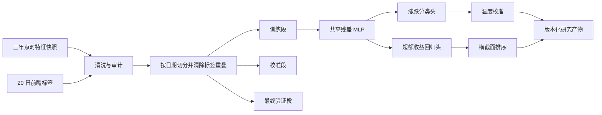

# DL-D0 深度学习基线

> 截至 2026-07-29。研究用途，不参与正式策略选股、竞赛持仓或模拟下单。

## 1. 定位

DL-D0 是独立于经典模型的深度学习 Challenger。它复用现有点时数据和
20 个交易日标签，用同一套共享表征同时完成：

1. `down / flat / up` 三分类概率预测；
2. 未来 20 个交易日相对基准的超额收益预测；
3. 同一交易日股票之间的横截面排序。

它的第一目标不是替换当前经典 Champion，而是建立一条可复现、可比较、
可继续演化到时序模型的深度学习训练链路。



## 2. 数据契约

本次真实快照包含 352,180 行特征、845 只股票、740 个交易日；20 日标签
可用 341,825 行。清洗后分为：

| 数据段 | 日期 | 行数 | 用途 |
|---|---:|---:|---|
| 训练 | 2023-07-13 至 2025-07-09 | 225,398 | 特征选择、清洗参数、模型权重 |
| 校准 | 2025-08-07 至 2025-12-16 | 43,190 | 早停和概率温度校准 |
| 最终验证 | 2026-01-16 至 2026-07-01 | 53,577 | 只做一次最终评估 |

训练段与校准段、校准段与验证段之间均按 `label_end_date` 清除重叠，
保证前一段样本的未来收益不会进入后一段。

清洗规则：

- 仅在训练段计算覆盖率、中位数、分位数边界和尺度；
- 将正负无穷转为缺失值，再执行 1%/99% winsorize、中位数填充和 IQR 缩放；
- 删除覆盖率低于 55%、常量和非零支持不足的字段；
- 只用训练标签做横截面 IC 排序及高相关特征剪枝，最多保留 48 个字段；
- 标识列、原始 OHLCV、标签和任何未来收益字段不得成为输入；
- 情报因子必须经过现有 lifecycle 晋级到 `model_iteration/active`，否则即使
  覆盖率提高也不会自动进入模型。

本次最终选中 48 个技术、基本面、产业、宏观和行业特征。23 个情报字段
全部因 lifecycle 仍为 `observing` 而被明确排除。

## 3. 模型与训练

架构为 48 维输入、128 维共享隐藏层、残差块、64 维瓶颈，以及两个独立
输出头，共 48,452 个参数。

总损失：

```text
0.45 * 加权三分类交叉熵
+ 0.35 * 超额收益 Huber 损失
+ 0.20 * 同日确定性成对排序损失
```

训练按完整交易日组成批次并逐 epoch 打乱日期，避免排序损失比较不同日期
的股票。优化器为 AdamW，最大训练样本 180,000，校准段连续 4 个 epoch
无改善即早停。本次在 Apple MPS 上第 7 个 epoch 最优，11 个 epoch 后停止，
纯训练约 20 秒。

## 4. 第一版结果

最终研究产物：

`data/research/deep/models/a_share/20/DL-D0-V001-ddf85ec1-ef687f81-69b6b897`

| 指标 | 结果 | 解读 |
|---|---:|---|
| Accuracy | 45.69% | 有一定方向辨识，但不能单独据此交易 |
| Macro AUC | 0.5366 | 略高于随机 |
| Log loss | 1.0649 | 尚未优于验证段类别先验 |
| Return MAE | 10.36% | 比恒预测 0 改善约 0.31 个百分点 |
| Rank IC | 0.0515 | 存在弱到中等横截面排序信息 |
| Rank ICIR | 0.3592 | 稳定性仍不足 |
| 头尾十分位 20 日价差 | +1.67% | 排序方向在最终验证段为正 |

考虑 20 日标签重叠后，block bootstrap 的 Rank IC 95% 区间为
`[-0.0132, 0.1183]`，头尾十分位价差区间为 `[-2.61%, 6.47%]`。两个区间
都跨过 0，因此当前只能说“观察到正向点估计”，还不能说统计上已确认有效。

重新加载 `model.pt` 后，对 53,577 条验证样本做批量推理，概率最大误差
`1.79e-7`、收益预测最大误差 `2.61e-8`，说明训练和推理契约一致。

产物通过临时目录完整写入后一次性发布；`manifest.json` 保存逐文件 SHA-256，
模型版本包含数据集、实现、运行设备和权重内容哈希。MPS 的部分反向算子不
保证跨次训练逐位一致，因此每次不同权重会得到不同版本；同一已发布版本的
模型和推理结果不可被静默覆盖。

线上最近的经典 20 日模型历史结果曾达到 Rank IC 约 0.085，但验证窗口与
本次不完全相同，不能作严格同场结论。当前证据只支持：DL-D0 已建立可运行
基线，尚未证明优于经典 Champion。

## 5. 语料与下一阶段

LLM 抽取结果已经以 candidate、canonical event、entity、fact、evidence 和
score 的结构化记录落库，但截至本次审计仅 38 篇独立文档完成语义运行，
其中 11 个 canonical event，覆盖不足以训练稳定的事件表示。

后续路线：

1. 扩大语义处理吞吐并修复 materiality 空值、证据 quote 和单位校验问题；
2. 满足事件因子证据门槛后，先做同窗口 Base 与 Base+Event 配对实验；
3. 在 RTX 5090 训练 60 日时序编码器，将价格、量、基本面状态和事件序列
   分塔编码，再与 DL-D0 比较；
4. 通过独立回测、概率校准、交易成本和影子周期门槛后，才允许注册为
   Challenger；任何版本都不能直接替换正式 Champion。

## 6. 复现

```bash
python3 -m venv --system-site-packages .venv-deep
.venv-deep/bin/pip install -r requirements-dl-train.txt

.venv-deep/bin/python -m stock_analyze.research.deep.training \
  --features data/research/features/a_share/20260729.parquet \
  --labels data/research/labels/a_share/20260729.parquet \
  --config configs/research/deep_d0.json \
  --output-root data/research/deep/models
```

RTX 5090 机器只需要同步代码、输入 Parquet 和独立训练依赖。正式 ECS
继续负责轻量数据任务与未来推理，不承担全量训练。
