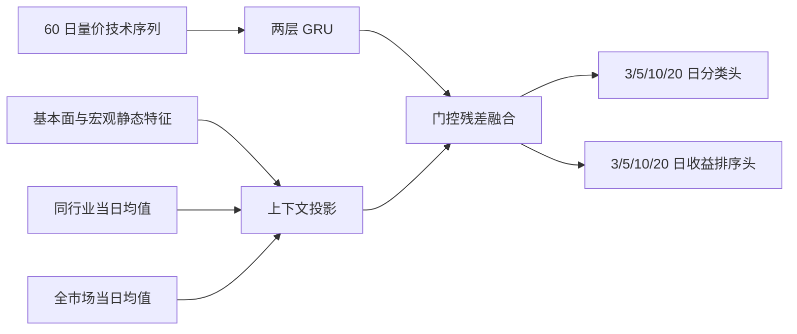

# DL-D1 时序上下文模型

> 截至 2026-07-29。研究用途，不参与正式策略、竞赛持仓或模拟下单。

## 1. 本阶段实现

DL-D1 在 DL-D0 单日截面基线之上增加：

- 每只股票最近 60 个交易日的技术和量价序列；
- 每个输入值对应的显式有效性掩码；
- 目标日同行业均值和全市场均值；
- 基本面、产业链、行业状态与宏观静态上下文；
- 共享两层 GRU，以及 3/5/10/20 日四组分类和超额收益头。

序列用历史行索引保存，训练批次才组装张量，避免为每个目标重复复制
60 日数据。行业和市场上下文只使用目标日可见的截面。

## 2. 真实训练

最终模型：

`data/research/deep/models/a_share/multi_horizon/DL-D1-V001-c8af8caa-6a76bbd4-d133505c`

| 项目 | 数值 |
|---|---:|
| 训练序列 | 204,175 |
| 校准序列 | 42,482 |
| 验证序列 | 53,563 |
| 时序字段 | 21 |
| 静态字段 | 30 |
| 参数量 | 65,904 |
| 最优 epoch | 1 |
| 实际训练 epoch | 5 |

训练损失在后续 epoch 继续下降，但校准分数从第一轮开始恶化，因此早停恢复
第一轮权重。这说明当前容量已经出现过拟合倾向。

## 3. 最终验证

| 周期 | Accuracy | AUC | Rank IC | 头尾十分位价差 |
|---:|---:|---:|---:|---:|
| 3 日 | 43.60% | 0.5247 | -0.0123 | -1.19% |
| 5 日 | 45.34% | 0.5286 | 0.0100 | -1.25% |
| 10 日 | 42.87% | 0.5296 | 0.0156 | -2.18% |
| 20 日 | 46.20% | 0.5261 | 0.0528 | -2.41% |

所有 Rank IC 与组合价差的 block-bootstrap 95% 区间均跨过 0。DL-D1
没有通过独立模型收益门槛，不能晋级 shadow 或正式模型。

## 4. 与 DL-D0 配对比较

在共同的 53,563 行、108 个验证交易日上：

| 模型 | Rank IC | 头尾十分位价差 |
|---|---:|---:|
| DL-D0 | 0.0516 | +1.67% |
| DL-D1 | 0.0528 | -2.41% |
| D0/D1 等权排名 | 0.0576 | +0.09% |

D0 与 D1 的日内预测排名相关性为 0.335，说明时序模型提供了不同信号；
但等权组合只提高 Rank IC，没有形成可交易的头尾价差，置信区间仍跨 0。

机器可读结果：

`data/research/deep/comparisons/20260729-dl-d0-vs-dl-d1.json`

## 5. 阶段结论

DL-D1 工程链路完成，但研究门槛未通过。正确动作是保留不可变产物和配对
证据，不接入竞赛，不基于最终验证段反复调参。

下一轮必须回到新的训练/校准方案，在 RTX 5090 上预先冻结多 seed 与消融
实验，重点判断：

1. 多期限联合训练是否造成负迁移；
2. 行业/市场上下文是否真正增益；
3. GRU 信号能否改善交易成本后的 Top-N，而不只是平均 Rank IC；
4. 是否值得进入 DL-D1-V002，还是应停止该架构。

语义事件仍未满足 DL-D2 的覆盖和 lifecycle 门槛，因此本阶段没有将
`observing` 事件字段混入时序模型。
