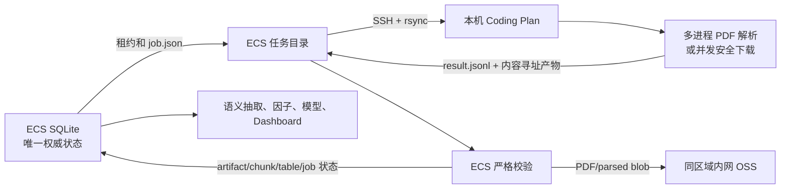

# 本机公告产物 Worker Harness

日期：2026-07-30  
状态：实现完成后交由其他 Coding Plan 执行历史积压  
范围：公告 PDF 历史下载与确定性解析，不包含 LLM 语义抽取

## 1. 目标和边界

这套 harness 让性能更强的 macOS 本机承担历史公告 PDF 下载、原生文本
解析、表格抽取和按需 OCR。ECS 继续承担调度、权威状态、OSS 写入、SQLite
写入、每日增量、语义抽取、因子供给和 Dashboard。

本轮 Codex 只实现并验证 harness，不持续消化历史积压。批量任务由用户后续
指定的 Coding Plan 执行。

明确不做：

- 不同步、复制或覆盖 ECS 的 `intelligence.sqlite3`。
- 不把 OSS、Tushare、DeepSeek 或飞书凭据复制到本机任务包。
- 不调用任何 LLM，不产生 DeepSeek API Token 消耗。
- 不处理当日 live 文档；本机只领取 `live_observed=0` 的历史任务。
- 不改变纸面交易策略、模型版本或正式下单链路。
- 不在本轮自动安装或启用 LaunchAgent。
- 不把 Coding Plan 当成不可信沙箱；执行者可以读取任务正文，因此只能使用
  用户授权的本机 Coding Plan/runner。

## 2. 架构



责任边界：

| 组件 | 可以做 | 不可以做 |
| --- | --- | --- |
| ECS export | 选择历史任务、创建租约、打包解析输入 | 执行本机计算 |
| 本机 runner | 读取任务包、下载 PDF、解析/OCR、写结果文件 | 访问生产 SQLite、OSS 或业务凭据 |
| ECS import | 校验 manifest、输入、输出、哈希、大小和身份后入库 | 信任本机声明而跳过校验 |
| ECS 原链路 | 继续处理 live 和未租约任务 | 抢占仍有效的本机租约 |

## 3. Canonical 实现清单

| 文件 | 职责 |
| --- | --- |
| `stock_analyze/intelligence/artifact_exchange.py` | export/run/import/status、租约、任务契约、内容校验、并发执行 |
| `stock_analyze/intelligence/schema.py` | V14 `artifact_worker_jobs/items` 权威审计表 |
| `stock_analyze/intelligence/operations.py` | ECS 下载和解析避让有效本机租约 |
| `stock_analyze/intelligence/artifact_backfill.py` | ECS 回填选择器避让有效本机租约 |
| `stock_analyze/cli.py` | 四个 `intelligence-artifact-job-*` CLI |
| `scripts/run-local-intelligence-artifact-worker.sh` | SSH/rsync 编排、互斥、AC 电源和依赖预检、失败保留 |
| `scripts/install-local-intelligence-artifact-worker-launchd.sh` | 可选的当前用户 LaunchAgent 安装器 |
| `deploy/launchd/com.stock-analyze.local-intelligence-artifact-worker.plist` | 每 30 分钟尝试一个有界任务 |
| `stock_analyze/dashboard_api.py` | 本机节点租约和累计回填的 Dashboard 投影 |
| `frontend/dashboard/src/IntelligencePanel.tsx` | 情报页的本机历史计算节点状态 |
| `docs/local-intelligence-artifact-worker.md` | 日常运维说明 |

测试：

| 文件 | 覆盖 |
| --- | --- |
| `tests/test_intelligence_schema_v14.py` | V13 到 V14 迁移 |
| `tests/test_intelligence_artifact_exchange.py` | 解析/下载、租约、过期、幂等、篡改、多进程、CLI |
| `tests/test_local_intelligence_artifact_worker_scripts.py` | shell、rsync、路径、电源、依赖、launchd 和失败恢复 |
| `tests/test_intelligence_operations.py` | 原 ECS 解析/下载行为 |
| `tests/test_intelligence_artifact_backfill.py` | ECS 回填选择与兼容 |
| `tests/test_dashboard_resource_api.py` | worker 状态投影 |
| `frontend/dashboard/src/IntelligencePanel.test.tsx` | 页面状态呈现 |

以上路径是 canonical source。不要把代码复制到另一套临时脚本中。

## 4. 任务交换契约

### 4.1 export

ECS 命令：

```bash
/opt/stock-analyze/venv/bin/python -m stock_analyze.cli \
  intelligence-artifact-job-export \
  --repo-root /opt/stock-analyze/app \
  --stage parse \
  --limit 20 \
  --worker-id coding-plan-history-01 \
  --lease-seconds 14400
```

输出最后一行是 JSON：

```json
{
  "status": "leased",
  "job_id": "awj-...",
  "job_dir": "/opt/stock-analyze/app/data/shared/intelligence/artifact_jobs/awj-...",
  "leased": 20,
  "lease_until": "..."
}
```

没有任务时返回 `status=empty`、`job_id=null`，退出码仍为 0。

`job.json` 固定包含：

- `contract_version=artifact-worker-job-v1`
- job、worker、stage、创建时间和租约截止时间
- 下载任务使用 `selection_policy=historical-download-recent-first-v1`，
  优先处理仍可访问的较新历史链接；解析任务使用
  `selection_policy=historical-parse-ready-first-v1`，优先消费已经下载完成的
  PDF。两者都只领取历史文档。
- 只领取 `metadata_json.ingestion_mode=history` 且 `live_observed=0` 的文档
- 冻结的 parser 配置或下载安全策略
- runner/parser 源码指纹
- 每篇文档的 `document_id`、`input_hash`、输入/输出相对路径
- 解析任务额外包含 PDF 哈希、大小、parser version 和目标 artifact ID

### 4.2 local run

```bash
python3 -m stock_analyze.cli \
  intelligence-artifact-job-run \
  --repo-root "/path/to/stock-analyze" \
  --job-dir "/path/to/local/job" \
  --workers 4
```

本机只生成：

- `outputs/*.pdf` 或 `outputs/*.parsed.json.gz`
- `result.jsonl`
- `run_report.json`

每个结果行固定包含：

- `contract_version=artifact-worker-result-v1`
- job/stage/ordinal/document/input identity
- `succeeded|failed_retryable|failed_terminal`
- 成功产物的相对路径、SHA-256、字节数和 MIME
- 解析结果的 `parse_status`
- 失败时的稳定错误码
- runner 源码指纹和 Python/PDF 依赖/Tesseract 运行时 provenance

解析任务使用独立进程，`--workers` 最大有效值为 8；下载任务使用线程并发。
解析器先尝试 PDF 原生文本和表格，只有文本不足的页面才调用 OCR。协议硬限制
单批最多 50 篇、单篇解析 JSON 24 MiB、压缩结果 16 MiB、整批输出
128 MiB；ECS import 先逐篇完整预检，再逐篇重读写入，不把整批解析对象同时
留在内存。

### 4.3 import

```bash
/opt/stock-analyze/venv/bin/python -m stock_analyze.cli \
  intelligence-artifact-job-import \
  --repo-root /opt/stock-analyze/app \
  --job-dir /opt/stock-analyze/app/data/shared/intelligence/artifact_jobs/awj-...
```

ECS 在任何写入前校验：

1. job 必须来自权威任务目录，manifest 哈希与数据库一致。
2. 租约仍有效；写 OSS/DB 前原子切换为 `importing` 并延长 fenced lease。
3. 文档集合、序号、输入哈希与 manifest 一致。
4. 所有相对路径不能越界、不能是符号链接。
5. 解析输入 PDF 没有被回传端修改。
6. 输出哈希、大小、MIME、PDF magic、parser version、PDF identity 一致。
7. gzip JSON 有解压大小上限并能重建严格 dataclass。

成功后由 ECS 使用已有内容寻址 OSS 接口写 blob，再事务性写入 artifact、
chunk 和 table。重复 import 返回 `reused=true`，不会产生重复数据。完成后
删除 ECS job 的 `inputs/outputs/tmp` 大载荷，只保留小型审计文件。

这里的哈希用于完整性与版本漂移检查，不是恶意 executor 的密码学证明。一个
主动伪造正文并重算哈希的 executor 仍能造假，因此本机 Coding Plan/runner
必须是用户信任的执行者。

### 4.4 lease

- 本机 worker 通过有效租约避让重复任务；canonical shell runner 还复用 ECS
  `/run/stock-analyze-intelligence-reconcile.lock`，避免与原回填选择窗口竞态。
- ECS 原下载、解析和回填查询会跳过有效租约。
- 租约过期后下一次 export/status 会标记 `expired`，任务可以重新领取。
- retryable 失败先退避 1 小时，累计 3 次后进入 quarantine；terminal 失败
  直接隔离，不会被下一次调用马上重领。
- 本机断网、休眠或 Coding Plan 退出不会锁死队列。
- 不要手工修改 `artifact_worker_jobs/items`。

## 5. 本机环境

必要条件：

```bash
brew install tesseract tesseract-lang
tesseract --list-langs | rg '^(chi_sim|eng)$'

python3 -c \
  'import fitz, pdfplumber, pypdf, pytesseract, yaml, httpx'
```

worker 会在领取 ECS 租约之前执行相同预检。缺少依赖或 `chi_sim` 时直接退出
2，不会占用任务。

SSH：

```text
默认远端: root@120.55.188.242
默认 key: ~/.ssh/ai_baby_aliyun
默认 ECS root: /opt/stock-analyze/app
```

脚本不会读取或打印 key 内容。OSS、Tushare 和 LLM 凭据均留在 ECS。

## 6. 交给另一个 Coding Plan 的执行顺序

### 6.1 部署与只读预检

先把 manifest 列出的精确文件部署到 ECS，不得运行整仓脏工作区同步。部署后
确认：

```bash
cd /opt/stock-analyze/app
/opt/stock-analyze/venv/bin/python -m unittest \
  tests.test_intelligence_artifact_exchange \
  tests.test_intelligence_schema_v14 \
  tests.test_intelligence_operations \
  tests.test_intelligence_artifact_backfill

/opt/stock-analyze/venv/bin/python -m stock_analyze.cli \
  intelligence-artifact-job-status \
  --repo-root /opt/stock-analyze/app
```

通过条件：测试全绿、状态返回 `status=ok`、数据库
`PRAGMA user_version=14`。然后在本机执行：

```bash
python3 -m unittest \
  tests.test_intelligence_artifact_exchange \
  tests.test_local_intelligence_artifact_worker_scripts

ssh -i ~/.ssh/ai_baby_aliyun root@120.55.188.242 \
  '/opt/stock-analyze/venv/bin/python -m stock_analyze.cli \
   intelligence-artifact-job-status \
   --repo-root /opt/stock-analyze/app'
```

### 6.2 一个解析 canary

```bash
./scripts/run-local-intelligence-artifact-worker.sh \
  --stage parse \
  --limit 1 \
  --workers 1 \
  --once
```

通过条件：

- 终端显示 claimed 和 imported。
- ECS status 新增一个 `parse/imported` job。
- 对应文档出现当前 parser version 的 parsed artifact。
- 输入、输出和 DB 哈希一致。

### 6.3 一个下载 canary

```bash
./scripts/run-local-intelligence-artifact-worker.sh \
  --stage download \
  --limit 1 \
  --workers 1 \
  --once
```

通过条件：

- ECS PDF artifact 从 queued/retryable 变为 downloaded。
- 对象写入 `stock-analyze-hz` 的内容寻址 key。
- status 新增一个 `download/imported` job。

### 6.4 有界批处理

先解析已经下载的历史 PDF：

```bash
./scripts/run-local-intelligence-artifact-worker.sh \
  --stage parse \
  --limit 20 \
  --workers 4
```

再补历史下载：

```bash
./scripts/run-local-intelligence-artifact-worker.sh \
  --stage download \
  --limit 40 \
  --workers 4
```

不传 `--once` 时，脚本仍受默认 10 批/3600 秒双重上限，每批另有 1800 秒
watchdog；到上限或 ECS 返回
empty 后停止。任一 `partial` 立即以退出码 3 停止，等待服务端退避，不会循环
轰击同一失败文档。成功任务只在本机保留 `history/<job_id>.import.json`
收据，大体积输入和输出会删除；失败任务目录完整保留以便排查。

### 6.5 可选自动化

确认至少各完成一个 canary 后，才允许安装：

```bash
./scripts/install-local-intelligence-artifact-worker-launchd.sh \
  --stage parse \
  --limit 10 \
  --workers 2
```

LaunchAgent 每 30 分钟最多处理一批，仅 AC 电源时运行，不补跑睡眠期间任务。
这一自动化不是生产依赖，本机离线时 ECS 原链路继续工作。

## 7. 推荐资源档位

| 档位 | parse | download | 用途 |
| --- | --- | --- | --- |
| Canary | `limit=1 workers=1` | `limit=1 workers=1` | 首次或升级后 |
| 保守 | `limit=10 workers=2` | `limit=20 workers=2` | 日常后台 |
| 标准 | `limit=20 workers=4` | `limit=40 workers=4` | 插电且机器空闲 |
| 上限 | `limit=40 workers=6` | `limit=80 workers=6` | 人工观察下短时运行 |

不要超过 8 worker。OCR 会明显增加 CPU、内存和临时磁盘占用；先按标准档观察
两个批次，再决定是否升档。

## 8. 状态与结果

CLI：

```bash
python3 -m stock_analyze.cli \
  intelligence-artifact-job-status \
  --repo-root /opt/stock-analyze/app
```

Dashboard 的“情报分析”页展示：

- 当前有效租约批数与文档数
- 本机累计成功回填文档数
- 下载/解析 imported、partial、failed、expired 批次数
- 最近完成时间

每批的权威审计仍在 SQLite：

```sql
SELECT stage, status, count(*)
FROM artifact_worker_jobs
GROUP BY stage, status;
```

## 9. 失败和恢复

| 失败 | 系统行为 | 操作 |
| --- | --- | --- |
| 本机睡眠/断网 | 本机目录保留，租约到期后可重领 | 恢复网络后重跑 |
| 本机 job 超过 30 分钟 | 返回 124，不上传半成品 | 查看保留日志，分类异常 PDF |
| 缺 Python/OCR 依赖 | 领取前退出 2 | 补依赖后重跑 |
| 单篇下载/解析重试失败 | import 记录 retryable，退避 1 小时 | 看 result 和来源 URL |
| retryable 累计 3 次 | 进入 quarantine，export 不再领取 | 汇总后人工分类 |
| 404/非 PDF/超限 | import 记录 terminal 并隔离 | 保留审计，不反复下载 |
| 输出被修改 | import 拒绝整个 job，不做部分写入 | 删除本机错误副本，等租约过期重领 |
| import 后重复执行 | 返回 reused | 无需清理 DB |
| 本机长期离线 | ECS 继续处理未租约和 live 任务 | 无需人工恢复生产 |

停止可选自动化：

```bash
launchctl bootout \
  "gui/$UID/com.stock-analyze.local-intelligence-artifact-worker"
```

停止 worker 不需要回滚数据库。有效租约自然过期，ECS 自动接管。

## 10. Token 与成本

下载、解析、表格识别和 OCR 都是确定性本地程序：

- DeepSeek API Token：0
- Codex/Claude 语义 Token：0
- OSS 写入：仍由 ECS 使用内网 endpoint
- Coding Plan 只负责启动、看状态和处理异常，不参与逐篇内容推理

后续 DeepSeek 语义抽取从 ECS 已解析文档读取结构化文本，是另一条独立任务；
本 harness 不改变其 provider-neutral 契约。

## 11. 完成定义

另一个 Coding Plan 批处理完成时必须报告：

1. 开始/结束时 downloaded、parsed、ocr_failed、retryable、terminal 数量。
2. download/parse 各 job 状态统计。
3. 平均每批耗时、文档吞吐和最高 worker 档位。
4. 失败原因 Top N，以及 retryable 是否仍在下降。
5. ECS 原 timer、DeepSeek、Dashboard 和纸面交易未被阻断。
6. 没有启动第二份 SQLite、没有旧 bucket URI、没有本机 OSS/LLM 凭据。
7. `quarantined_documents` 已汇总，失败文档没有被紧循环重试。

只看到脚本退出 0 不等于完成，必须以 ECS 权威表、OSS/DB 产物和 Dashboard
读回为准。
