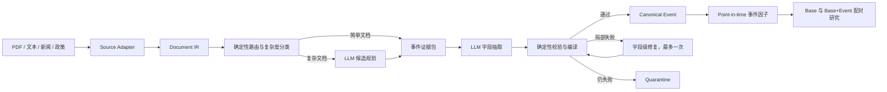

# 结构化、双执行模式的语义抽取 Harness 设计

**日期：** 2026-08-09  
**状态：** 已完成架构确认，待文档复核  
**首期范围：** A 股上市公司公告  
**扩展范围：** 新闻、政策、研报及其他 PDF/文本语料  
**安全边界：** 研究因子专用；原文、LLM 输出和单条事件均不得直接触发模拟交易

## 1. 背景与判断

V20 已证明 provider-neutral 的冻结任务、逐字证据校验、事件编译、隔离和
入库链路可以工作，但当前 harness 仍把过多责任交给 LLM：模型需要同时从
长文中定位事件、恢复表格语义、选择字段、绑定主体并组织证据。最后一轮
半年报失败就是典型例子：模型找到了正确数值，却没有同时引用行列标题，
编译器只能拒绝裸数值。

因此下一版不继续堆叠 Prompt 例外，而是先把原始文档编译成可验证的结构，
再让 LLM 在小而明确的证据包中做语义选择。

## 2. 目标与非目标

### 目标

1. 同一语义任务同时支持 API 和 Coding Plan 两种执行模式。
2. Prompt、Schema、Taxonomy、证据规则和下游事件不依赖具体 Provider。
3. 表格数值天然携带行标题、列标题、单位、页码和原文坐标。
4. 简单文档一次 LLM 调用；复杂文档采用规划加抽取的两阶段调用。
5. 校验失败时只修复失败字段，不重新生成整篇结果。
6. 验收阶段严格整批门控；稳定生产后逐篇入库、逐篇隔离，并监控漂移。
7. 任何结果都可由输入 hash、合同版本、执行器身份和原文证据重现。

### 非目标

- 不建设开放式问答或通用 Agent。
- 不让 LLM 生成实体 ID、标准日期、金额换算、生命周期或交易信号。
- 不默认使用多个模型重复抽取全部文档。
- 不在本次改造中证明事件因子能提升策略收益。
- 不删除 V20 及历史 semantic lineage；旧合同保持只读、可回放。

## 3. 总体架构



正常调用预算如下：

- 简单文档：一次字段抽取。
- 复杂文档：一次候选规划，加一次字段抽取。
- 只有确定性校验失败时，额外允许一次字段级修复；仍失败即隔离。

## 4. Source Adapter 与 Document IR

### 4.1 Source Adapter

每类语料只负责把来源格式转换为统一 IR，不参与事件判断：

- `announcement_pdf`：公告 PDF、正文、表格、OCR。
- `plain_text`：已经解析的纯文本。
- 后续插件：`news_article`、`policy_document`、`research_report`。

Adapter 的输出必须保留来源 URL、发布时间、首次发现时间、解析器版本、
页码、bbox、OCR 状态和内容 hash。

### 4.2 Document IR

IR 由不可变证据节点组成：

- `metadata_node`：标题、发行人、证券代码、发布日期。
- `text_block`：标题、段落、列表项、脚注。
- `table`：表标题、单位、行列层级和合并单元格信息。
- `table_cell`：原始值、行标题链、列标题链、单位和坐标。
- `relation`：相邻段落、标题归属、表头归属、跨页续表关系。

表格节点示例：

```json
{
  "node_id": "table-2-cell-r4-c3",
  "node_type": "table_cell",
  "raw_value": "621,408,705.13",
  "row_headers": ["营业收入"],
  "column_headers": ["本报告期"],
  "unit": "元",
  "page_number": 2,
  "bbox": [72, 318, 526, 346],
  "source_node_ids": ["table-2-row-header-r4", "table-2-col-header-c3", "table-2-unit"]
}
```

LLM 不再自行猜测裸数值含义。编译器也只接受能够沿 IR 关系找到语义表头
和单位的表格事实。

## 5. 任务规划与证据包

### 5.1 确定性预路由

路由器使用标题、文档类型、结构信号和版本化规则排除治理制度、会议通知、
否定式调查/退市表述和纯会计科目。它只缩小候选范围，不直接产生事件。

### 5.2 复杂度分类

下列结构信号使文档进入两阶段模式：

- 多个事件族同时命中。
- 多个主体或多个目标资产。
- 必需事实位于表格或跨页续表。
- OCR、长文、法律意见书或正文存在明显章节跳转。
- 同一数字可能对应多个主体或经济含义。

具体阈值保存在版本化配置中，不能由 Provider 自行调整。

### 5.3 候选规划

复杂文档的第一阶段只输出：

- 候选事件类型。
- 候选主体名称。
- 可能相关的 IR node IDs。
- 无法判断的原因。

它不输出最终事实、生命周期或标准化结果。候选规划失败不会产生事件。

### 5.4 事件证据包

每个抽取任务只包含一个候选事件及其相关节点：

- 文档元数据。
- 该事件允许的主体角色、字段和日期种类。
- 必需字段及生命周期要求。
- 相关文本窗口和完整表格语义路径。
- 严格输出 Schema。

规划和抽取各自使用一份稳定的通用 Prompt；事件差异来自版本化 Taxonomy
数据，不为 Claude、DeepSeek 或 Codex 维护不同 Prompt。

## 6. API 与 Coding Plan 双执行模式

### 6.1 统一冻结任务包

两种模式消费同一目录：

```text
job.json
input.jsonl
taxonomy.json
document_ir.jsonl
evidence_packets.jsonl
planner_prompt.md
planner_schema.json
extraction_prompt.md
extraction_schema.json
```

简单任务不消费 planner 文件；复杂任务先执行 planner，再执行 extractor。
两份 Prompt 都是稳定、通用且 Provider 无关的系统 Prompt，差异只在阶段
职责，不按模型维护分支版本。

任务包记录每个文件 hash、文档 ID、profile、两阶段 prompt/schema、
taxonomy、IR 和 planner 版本。任务创建后不可修改；任何合同变化必须产生
新 profile。

### 6.2 统一 Executor 接口

```text
execute(frozen_task) -> raw_result_envelope
```

结果信封必须包含：

- `job_id`、`document_id`、`task_id` 和输入 hash。
- `executor_mode`: `api` 或 `coding_plan`。
- Provider、模型、客户端版本和可信身份来源。
- Planner/Extractor Prompt、Schema、Taxonomy、IR 和 evidence packet hash。
- 原始结构化输出、request/session ID、token 和耗时。

执行器只能负责传输和调用，不能修改语义合同。

### 6.3 API 模式

- 用于 ECS 每日新增公告。
- 凭据由部署环境注入，不写入任务包和产物。
- 支持同步调用或 submit/poll 异步调用。
- 每篇独立 checkpoint，quota/rate limit 可恢复。
- 默认一个生产 Provider；当前候选为 DeepSeek。

### 6.4 Coding Plan 模式

- 用于本机历史回填、疑难文档和限量仲裁。
- Runner 把冻结任务逐篇交给 Codex、Claude 或其他 Coding Plan。
- Coding Plan 不生成批次脚本，不修改任务包，不访问生产数据库，也不直接入库。
- Runner 负责写入可信执行器身份、checkpoint 和统一结果信封。
- Coding Plan 不限制内部推理 token，但输入文档和输出仍受冻结任务边界约束。

### 6.5 并发与幂等

- 不使用全局 ECS 锁。中央 dispatcher 在导出任务前，以单个 `task_id` 为
  粒度写入执行通道、领取者和过期时间；API dispatcher 必须跳过已经分配给
  Coding Plan 的任务。
- Coding Plan 可在领取后离线运行。只有 claim 过期且没有回传结果时，任务
  才能重新分配；续租和回传都使用 task token，不依赖长连接。
- 导入键包含任务、输入和输出 hash；重复上传同一结果必须幂等。
- 因超时重领产生的不同 Provider 结果作为独立 run 保存，不能互相覆盖；
  只有当前指定执行通道的合格结果可以自动晋级，其他结果进入对照审计。

## 7. 校验、编译与修复

校验按固定顺序执行：

1. manifest、输入和合同 hash。
2. JSON Schema 和枚举。
3. 每个 node ID 是否属于当前证据包。
4. 文本 quote 是否为原文连续子串。
5. 表格事实是否同时拥有表头、数值和单位语义路径。
6. 主体角色和实体白名单。
7. 必需字段、去重字段和事件类型兼容性。
8. 生命周期只从被引用的状态证据推导。
9. 数值、比例、币种和日期的确定性标准化。
10. canonical 去重和 point-in-time 时间边界。

失败结果返回字段级错误，例如：

```json
{
  "field": "revenue",
  "code": "table_semantic_header_missing",
  "accepted_nodes": ["table-2-cell-r4-c3"],
  "required_evidence": ["row_header", "column_header", "value", "unit"]
}
```

修复任务只携带失败字段、原输出和允许补充的证据节点。修复不得重写已经
通过的主体和事实，也不得扩大事件范围。

## 8. 入库、隔离与运行模式

### 验收模式

- 10 篇为不可分割批次。
- 自动门和逐篇人工语义门必须全部通过。
- 任一严重错误使整批拒绝，用于判断新 profile 能否晋级。

### 稳定生产模式

- 合格文档逐篇入库，失败文档逐篇进入 quarantine。
- 严重错误立即暂停当前 profile。
- 普通失败率、事件分布、`no_event` 比例或字段覆盖异常时触发漂移告警。
- 漂移触发后抽取可以继续 checkpoint，但不得自动导入新结果。

Quarantine 保存原始输入、输出、错误、执行器身份和可重试原因，不删除
semantic run lineage。

## 9. 评估与晋级门槛

V21 使用至少 150 篇未参与调试的分层盲测集，覆盖 15 个公告事件类型、
`no_event`、表格、长文、OCR 和法律文件。Claude、DeepSeek、Codex 可在
同一冻结集上各跑一次用于比较，但生产不默认多模型重复抽取。

硬门槛：

- Schema、hash 和证据定位合法率：100%。
- 主体错绑、事件误分类、虚构事实和未来信息泄漏：0。
- 表格事实语义路径合法率：100%。
- 事件精确率：至少 95%。
- 强信号事件召回率：至少 90%。
- 强信号 `no_event` 漏报率：不超过 5%。
- quarantine 比例：不超过 5%。
- 所有指标按事件族、文档难度和 Provider 拆分，并报告置信区间。

未通过门槛时只修复具有共同根因的 IR、Planner、Taxonomy 或 Compiler；
禁止根据单篇样本持续增加 Prompt 特例。

## 10. 下游模型贡献

通过校验的结果继续进入现有 canonical event 和 point-in-time feature 主线。
新增 IR、执行模式和修复机制不得改变下游字段语义。

事件因子只有在相同股票、日期、标签和时间切分下，通过 Base 与
Base+Event 配对实验，并在 OOS IC、净成本组合表现、回撤和跨窗口稳定性上
有增益，才能进入模型 registry 候选。策略必须显式激活模型版本；抽取器
上线不等于策略自动使用事件因子。

## 11. 可观测性

Dashboard 和日报至少展示：

- 下载、解析、IR、候选规划、抽取、校验、入库各阶段数量和延迟。
- API/Coding Plan 各自请求量、token、成功率和 quarantine。
- 按事件族、文档难度、解析方式统计的错误分布。
- 当前 profile、Prompt、Taxonomy、IR 和 Provider 版本。
- canonical event 覆盖率、特征快照时间和实际被模型选中的事件因子。
- Base 与 Base+Event 最新研究结论，明确标记 research/active 状态。

## 12. 实施顺序与回滚

1. 建立包含现有失败样本的结构恢复回归集。
2. 实现 Document IR 和公告 Source Adapter，不调用 LLM。
3. 实现证据包、复杂度分类和两阶段任务合同。
4. 接入 API Executor 与 Coding Plan Executor。
5. 实现字段级修复、逐篇入库和漂移门控。
6. 冻结 V21，运行 150 篇盲测及 Provider 对照。
7. 先以 shadow 模式运行每日增量，再显式启用 DeepSeek API 生产。
8. Coding Plan 使用同一 V21 合同继续历史回填。

V20 保持只读。V21 未通过盲测时，生产继续停留在 V20/暂停状态；已入库的
V20 事件和 lineage 不回写。V21 上线后若触发严重错误或漂移门，停止新导入
并回退到上一 active profile，不删除已经产生的 run 和 quarantine。

## 13. 验收结果定义

本设计完成的标志不是“某个模型输出了 JSON”，而是：

1. 同一冻结任务可由 API 和 Coding Plan 无差别执行并得到可比产物。
2. 表格、文本和 OCR 证据均能被确定性复核。
3. 失败只影响当前文档或当前 profile，不污染 canonical events。
4. 150 篇盲测达到门槛并完成 shadow 运行。
5. Dashboard 能说明语料如何形成事件、因子是否被模型使用，以及是否产生
   经 OOS 验证的增益。
