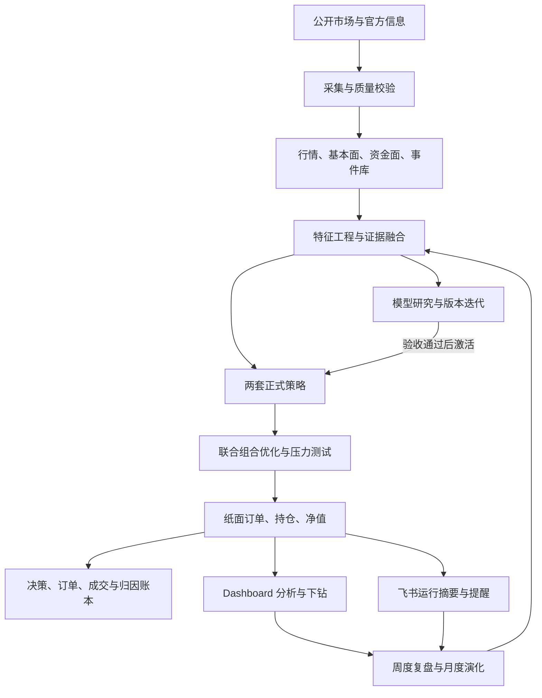
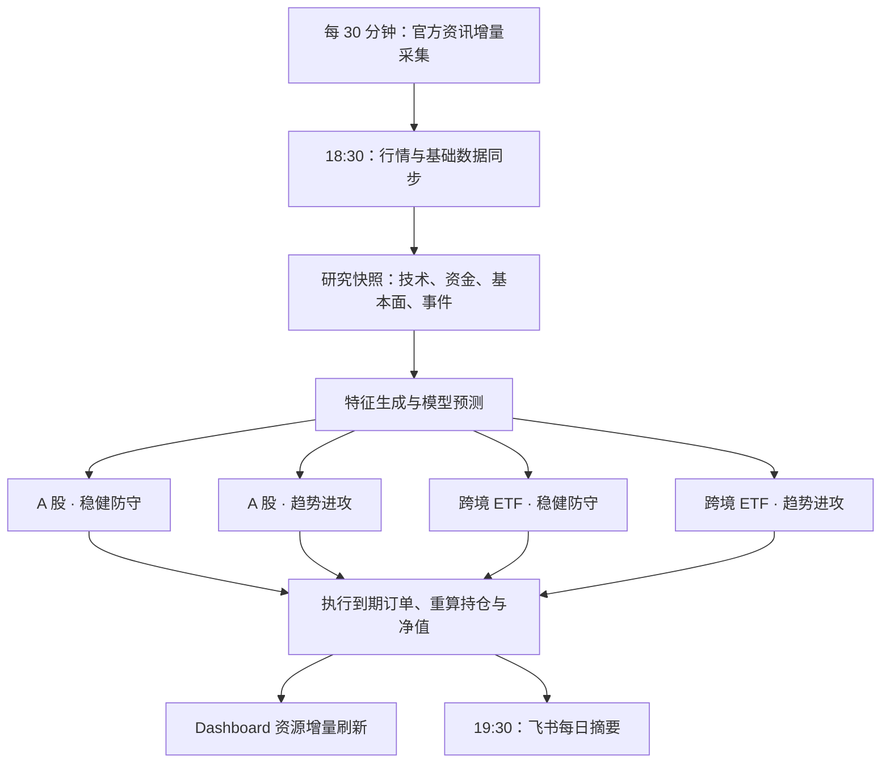
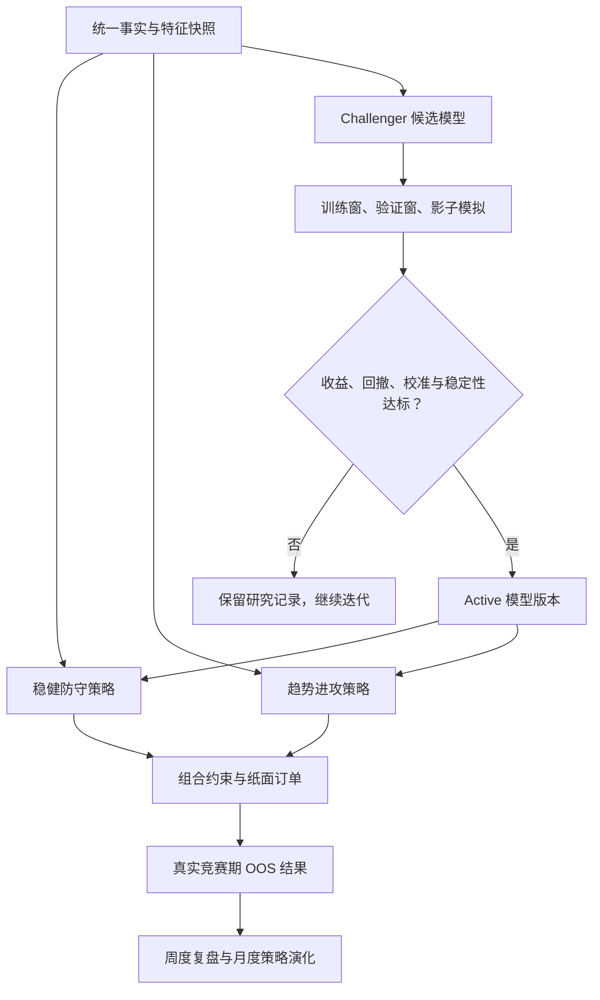
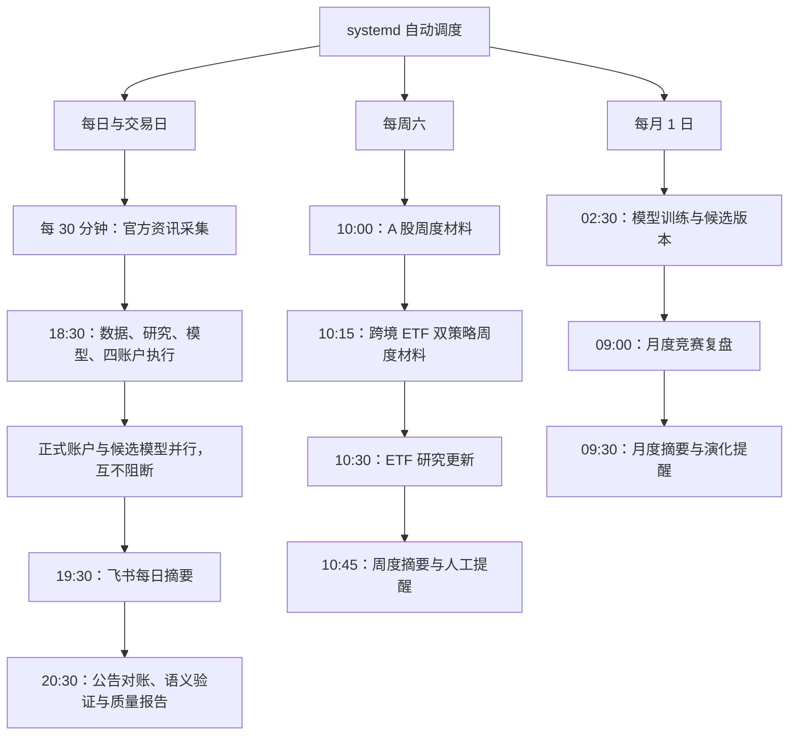

# Stock Analyze 系统架构与运行全景

更新日期：2026-07-30

Stock Analyze 是一套面向 A 股（`a_share`）与境内跨境 ETF（`cn_qdii_etf`）的研究、纸面交易和策略竞赛系统。它持续收集市场与公开信息，把证据加工成可审计的决策，再用两套正式策略和独立的模型迭代链路检验效果。

> **先记住三个结论：**系统不会连接真实券商；日常数据、预测、模拟下单和通知均自动运行；人工只需在周度复盘和月度策略演化收到提醒后，让 LLM 完成判断与配置演进。

## 读懂系统只需要三件事

| 系统交易什么 | 谁在做决策 | 人什么时候介入 |
| --- | --- | --- |
| **A 股**与**境内跨境 ETF**。境外股票市场不再作为可交易账户，只保留必要的指数和宏观参考数据。 | **稳健防守**与**趋势进攻**独立竞赛；模型在研究链路中迭代，只有通过验收的 Active 版本才可进入正式策略。 | 平日无需盯任务。周末查看复盘提醒，月初查看演化提醒；异常只接收汇总告警。 |

## 1. 系统如何运转

系统不是一组相互独立的脚本，而是一条从数据事实到策略决策、再到可观测结果的闭环。Dashboard 只是观察入口，不是数据源；飞书只负责摘要和行动提醒，不承载运行状态。



### 每个交易日发生什么

交易日晚间先补齐事实，再生成研究结论和模型预测，最后分别执行四个正式账户。这样每张订单都能追溯到当日数据、策略版本和风险约束。



| 阶段 | 系统产物 | 失败时怎么处理 |
| --- | --- | --- |
| **事实层** | 行情、估值、财务、资金、公告和政策事件 | 保留已有数据，标记陈旧度与缺失原因，不伪造补值 |
| **决策层** | 候选排序、上涨概率、置信度、淘汰原因、目标权重 | 覆盖不足时退回固定规则或空仓，不用不完整证据强行下单 |
| **执行层** | 联合优化、压力测试、目标订单、成交、持仓、成本后净值 | 遵守交易日、资金、仓位、流动性、换手和暴露约束，逐层写入不可变审计账本 |
| **观察层** | 策略对比、个股 K 线、归因、任务状态 | 接口独立失败，页面其余资源仍可先展示 |

## 2. 策略与模型如何共同决策

两套正式策略是平行账户，不是同一策略的两个页面筛选项。模型迭代是独立的研发通道：候选版本先在影子环境验证，达到门槛后成为 Active 版本，再被正式策略消费。正在研发的 Challenger 不会直接影响正式下单。



| 对象 | 核心目标 | 偏好 | 与模型的关系 |
| --- | --- | --- | --- |
| **稳健防守** | 控制回撤，追求较稳定的成本后收益 | 质量、估值、低波动、分散和持有缓冲 | 只读取已激活 Ranker，按 10/20 日 `40%/60%` 融合；陈旧或缺失时退回规则策略 |
| **趋势进攻** | 捕捉趋势和拐点，接受更高换手 | 动量、量价、资金、技术交叉和事件催化 | 只读取已激活 Ranker，按 3/5 日各 `50%` 融合；陈旧或缺失时退回规则策略 |
| **模型迭代** | 提升概率排序、校准和风险识别能力 | Champion、Challenger、版本审计、影子验证 | 研发通道本身不等于第三套正式策略 |

模型按角色分别验收：Classifier 看概率校准、Brier、AUC 和命中提升；Ranker 看 Rank IC、ICIR、稳定性与统计抗过拟合证据；Portfolio 看成本后超额、回撤、换手、容量和压力损失。候选版本至少完成 12 个独立影子周期，并通过 Deflated Sharpe、PBO、时点和无幸存者偏差门禁，才可能成为 Active。模型迭代任务与四个正式账户在 systemd 层隔离，候选失败会单独告警，不会阻断规则策略继续运行。

### 一次决策用了哪些证据

| 证据层 | 已接入信息 | 在决策中的作用 |
| --- | --- | --- |
| **基本面** | PE、PB、ROE、毛利率、负债率、利润增长、股息率 | 判断质量、估值与财务风险，避免只看价格形态 |
| **技术面** | 动量、波动率、均线、成交量、MACD、量价关系 | 识别趋势、交叉、背离和可能的拐点 |
| **资金面** | 换手率、成交额、资金流、融资融券 | 验证行情是否有真实资金承接，并约束流动性 |
| **消息与政策** | 基金公告、国务院和发改委政策、结构化事件 | 生成催化、风险和产业链影响，不把标题直接当交易信号 |
| **组合约束** | 单股权重、行业暴露、持仓缓冲、成本与可交易性 | 把个股分数转成可执行且可比较的组合 |

新特征不会因为“看起来有用”就直接参与正式下单。它必须先通过时间可见性、覆盖率、稳定性和增量价值验证，再进入模型或策略。

## 3. 数据从哪里来

生产主链以 Tushare Pro 为核心，A 股行情故障时可由 Baostock 降级补充。公告与政策只采官方或公开来源；未获得授权的数据不会冒充已接入能力。系统会记录来源、抓取时间、发布时间和内容哈希，便于复核。

| 来源 | 覆盖 | 用途 | 当前状态 |
| --- | --- | --- | --- |
| **Tushare Pro** | A 股日线、估值、资金、融资融券、财务、指数与公司公告；ETF 日线、复权、净值、份额、全球指数、汇率 | 行情、因子、组合估值、净值计算和公司事件发现 | 已接入 |
| **Baostock** | A 股历史行情与部分基础字段 | 主源异常时的行情降级 | 已接入 |
| **东方财富公开页** | 境内基金与 ETF 公告发现 | 发现待核验的基金事件；聚合页本身不能形成正式硬阻断 | 已接入发现层 |
| **交易所与基金管理人公告** | ETF 停复牌、申赎限制、清盘与恢复公告 | 对聚合发现做官方确认后，驱动按申购/赎回/交易范围区分的状态机 | 接口契约已定义，适配器待确认 |
| **中国政府网、发改委** | 宏观政策和产业政策 | 政策事件、行业影响和风险标签 | 已接入 |
| **证监会公开页** | 监管公告 | 预留监管事件补充 | 重定向问题，暂禁用 |
| **央行、财政部、统计局、海关** | 利率、财政、经济与贸易数据 | 宏观状态和政策事件增强 | 接口契约已定义，适配器待接入 |
| **Tushare `anns_d` 公告** | A 股公司公告元数据及巨潮资讯原文链接 | 公司事件提取、证券关联与研究因子观察 | 已授权并接入 |
| **Tushare 商业新闻** | 新闻与舆情 | 公司和行业情绪增强 | 当前账号未授权，保持不可用 |
| **同花顺 iFinD、Choice、富途** | 商业行情、资讯与特色数据 | 未来增强源 | 未授权，未接入 |

Nasdaq、标普和恒生等指数画像仅用于识别跨境 ETF 的底层暴露，不代表系统在直接交易境外股票。当前明确缺口是稳定授权新闻流、ETF 申赎清单与资金流，以及更丰富的海外利率和宏观数据；缺失特征保持缺失或低置信度，不做伪造填充。

## 4. Dashboard 能回答什么

Dashboard 以五个稳定工作区组织观察路径，市场范围与工作区导航彼此独立。首屏只呈现当前状态，点击流程节点再查看真实数据、模型、计划与运行证据。

| 工作区 | 回答的问题 | 首屏接口 |
| --- | --- | --- |
| **决策总览** | 数据、情报、模型和正式策略是否真实连接 | `system-overview.json` |
| **策略工作台** | 两种正式策略表现如何，当前持仓和计划是什么 | 现有拆分策略资源 |
| **模型研究** | 接了什么数据、训练了什么、指标如何、是否模拟和采用 | `model-research.json` |
| **数据与情报** | 传统因子和情报因子来自哪里，被谁实际使用 | `data-intelligence.json` |
| **运行中心** | 今天跑到哪里，下次何时，是否需要人工 | `operations-center.json` |

`等待计划时间`、`等待上游`、零入选和正常历史回填不是故障。只有运行中心 `interventions` 中的项目，才表示系统无法自动恢复或已经达到人工决策门槛。单个读取段不可用时，页面显示“部分状态不可用”，其余有效流程、矩阵、计划和历史仍继续呈现。

| 页面问题 | 回答方式 | 主要交互 |
| --- | --- | --- |
| **为什么净值涨或跌** | 分开呈现组合收益、基准收益、交易成本、个股贡献和因子归因 | 时间范围、策略、市场和归因维度切换 |
| **哪天买了什么** | 交易时间轴与持仓变化按日期排列 | 点击日期和证券下钻 |
| **为什么选或不选** | 展示概率、置信度、证据覆盖、风险标签和淘汰原因 | 候选排序、原因筛选、字段中文解释 |
| **买卖点是否合理** | 三年真实 K 线，默认一个月，叠加均线、成交量、MACD 和成交标记 | 指标开关、缩放、联动十字线、悬浮详情 |
| **任务有没有正常跑** | 按资源展示新鲜度、成功状态、失败摘要和通知情况 | 仅在运维页查看，不干扰分析主流程 |

Dashboard 由 React 18、TypeScript、Vite、TanStack Table、TradingView Lightweight Charts 和 Lucide 构建。策略工作台继续按 `overview`、`performance`、`portfolio`、`predictions`、`research`、`operations`、`governance` 拆分资源；模型研究、数据与情报、运行中心各有独立首屏接口，配合语义 ETag、限量缓存和严格载荷上限渐进加载。`governance` 仍独立承载决策漏斗、风险压力、归因、漂移、实验和情报因子证据。

## 5. 自动任务与人工动作

生产环境由 systemd 统一调度，目前有 13 个 timer。任务遵循“先数据、再研究、再模型、再交易、最后通知”的依赖顺序；周度任务负责复盘材料与策略观察，日度任务负责纸面订单执行。



| 周期 | 时间 | 主要动作 | 是否需要你介入 |
| --- | --- | --- | --- |
| **资讯** | 每 30 分钟 | 抓取官方政策、基金公告和 A 股公司公告元数据，去重并生成结构化事件 | 否 |
| **公告产物** | 每 2 小时 | 有界续跑 PDF 下载、版面解析、表格和 OCR 队列，不调用语义模型 | 否 |
| **交易日主链** | 周一至周五 18:30 | 同步数据、研究、预测并执行四个纸面账户 | 否 |
| **每日摘要** | 周一至周五 19:30 | 发送整体结果、关键异常和最多 3 条最高置信度预测 | 仅异常时查看 |
| **公告对账** | 每天 20:30 | 对账近两日目录，处理语义、确定性校验、因子快照和质量报告 | 仅异常时查看 |
| **周度链路** | 周六 10:00 至 10:45 | 生成周度材料、ETF 研究和汇总提醒 | 收到提醒后运行周度复盘 |
| **月度链路** | 每月 1 日 02:30 至 09:30 | 训练候选模型、生成竞赛月报和演化提醒 | 收到提醒后运行月度策略演化 |

人工只需要发送两类指令：

```text
运行 YYYY-MM-DD 周度复盘
运行 YYYY-MM 月度策略演化
```

不需要手动触发 `run-daily` 或逐个维护 timer。系统异常时，飞书只推送一条聚合信息，包含失败阶段、影响范围和建议动作。

## 6. 技术路线与数据边界

| 层次 | 主要技术 | 设计目的 |
| --- | --- | --- |
| **数据与计算** | Python、Pandas、NumPy、scikit-learn、TA-Lib | 低频研究、特征计算、概率模型和可复现回测 |
| **存储** | CSV、JSON、Parquet、SQLite | CSV 账户事实保持 canonical；SQLite 保存可重建的决策、成交、归因、实验与情报查询投影 |
| **服务** | Python Dashboard API、语义 ETag、分资源缓存 | 拆分大接口，让页面逐块加载且避免重复传输 |
| **前端** | React 18、TypeScript、Vite、TanStack、Lightweight Charts、Lucide | 动态数据、专业图表、交互下钻和统一状态管理 |
| **运行与通知** | systemd、ECS、飞书机器人与云文档 | 稳定调度、集中日志、精简告警和长期存档 |

核心责任边界：配置定义市场、账户和策略；共享数据目录保存行情与基准；策略目录保存各自订单、持仓、净值和演化记录；竞赛目录只保存允许跨策略比较的结果；报告目录是可再生成的展示产物。

```text
configs/                市场、竞赛、策略与调度配置
data/shared/            共享行情、基准、证券主数据
data/competition/       合规的策略对比与月度结果
data/<market>/<id>/     两套策略的账户事实
data/research/models/   研究模型、门禁和角色状态
data/model_iterations/  候选版本的独立模拟组合
data/shared/research_lineage.sqlite3  决策到归因的追加式审计投影
data/shared/intelligence/             文档、事件、来源健康和原始证据
reports/                可再生成的报告与 Dashboard 资源
logs/                   任务运行和失败证据
archive/                已退出生产的只读逻辑与数据
```

Canonical 运行路径是 `data/<market>/<strategy_id>/` 和 `reports/<market>/<strategy_id>/`。`claude`、`codex` 仅保留为底层历史兼容 ID，产品和页面统一使用“稳健防守”“趋势进攻”。

## 7. 如何判断系统是否健康

| 观察项 | 健康信号 | 需要关注的信号 |
| --- | --- | --- |
| **数据** | 交易日更新及时，字段覆盖稳定，来源和日期可追溯 | 连续陈旧、代码无名称、复权异常或主源与降级源冲突 |
| **策略** | 两套策略持仓与因子驱动保持差异，成本后结果可解释 | 长期高度重合、频繁无效换手、收益只靠少数异常样本 |
| **模型** | 角色门禁、12 周期、DSR/PBO、无偏样本和漂移状态同时达标，版本可回滚 | 只看准确率、验证窗反复调参、候选版本直接影响正式订单 |
| **运维** | 13 个 timer 按依赖完成，Dashboard 新鲜，飞书消息少而完整 | 同一错误重复告警、日报缺失、接口整体阻塞或任务静默失败 |

纸面交易结果用于比较策略和改进系统，不构成收益承诺。回测、影子账户和竞赛期结果必须分开阅读；短期领先也不能自动证明策略已经稳定。

## 附录：近期改造脉络

| 阶段 | 完成内容 | 带来的变化 |
| --- | --- | --- |
| **交易边界收敛** | 移除港股、美股直接模拟，建立 A 股与境内跨境 ETF 正式账户 | 系统交易范围与大陆可行路径一致，境外信息只做底层暴露参考 |
| **双策略重构** | 将旧代理概念改造成稳健防守和趋势进攻，并增加多维对比 | 比较对象变成可解释的投资风格，不再暴露 agent 页面语义 |
| **专业分析补齐** | 三年 K 线、均线、成交量、MACD、成交点、基准和中文字段解释 | 能沿时间和证券下钻，不再只看静态汇总表 |
| **模型治理** | 建立 Champion、Challenger、Active、影子验证和版本门禁 | 研发模型与正式策略隔离，验收通过后才影响下单 |
| **资讯与决策证据** | 接入官方政策和基金公告，统一基本面、技术面、资金面与事件证据 | Dashboard 能解释选中、淘汰和风险原因，而不只展示结果 |
| **服务与运维** | 拆分 Dashboard 资源接口、优化缓存、整理 systemd 链路和飞书通知 | 页面渐进加载，任务依赖清晰，消息从流水线噪声变成摘要和行动提醒 |
| **P0-P2 成熟化** | 角色化模型门禁、明确期限、时点 ETF 宇宙、联合优化、压力测试、统计治理、漂移隔离、全链路账本和每日归因 | 正式决策可重建、候选模型失败不拖累正式策略、研究证据不足时明确降级而非伪装可用 |

本轮 P0-P2 的模块、门禁和降级契约见
[quant-system-p0-p2-closure.md](quant-system-p0-p2-closure.md)。执行和排障从
[system-harness.md](system-harness.md) 开始。运行状态、数据规模与模型版本以
Dashboard 和 ECS 实时记录为准；本文负责解释系统结构和操作边界。

公告子系统的日常操作见
[公告情报运维手册](announcement-intelligence-runbook.md)。
